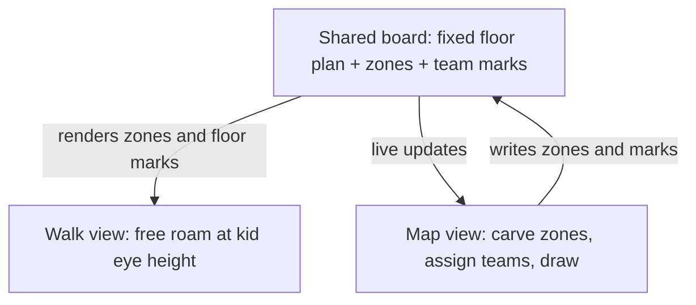
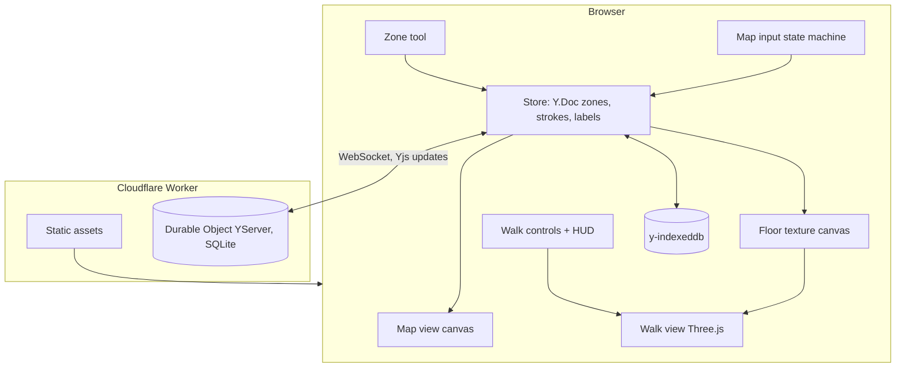
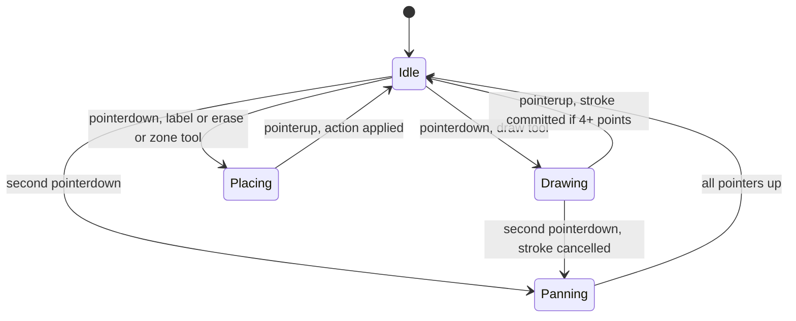
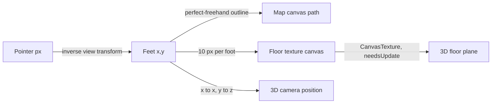

# Haunted House Layout Tool - Plan

## Goal Capsule

- **Objective:** Every team lead for the school haunted house can see their zone of the gym at real scale on their phone, mark it up for their team, and walk the whole house at a third grader's eye height, so that scare pacing and space use are judged from the space itself instead of guessed from a paper sketch.
- **Means:** One web page behind a shared link with two views of the same locked floor plan: a top-down map with team zones and freehand marker drawing, and a first-person free-roam walkthrough. Built as a single Cloudflare Worker project that serves the static app and runs the shared document (KTD1, KTD2).
- **Product authority:** This plan owns the full v1 tool. Follow-ups named under Scope Boundaries (guided walk with timing, scare beats, concept art in 3D, sized props, walking together) are not active scope. The Product Contract wins on product behavior; the Planning Contract wins on mechanism within it.
- **Execution profile:** Greenfield web app, Node 22, no framework. Implementation units run in dependency order per the Unit Index; U2 and U3 can run in parallel, U4 through U6 and U7 through U8 form two chains that can run side by side after U3.
- **Stop conditions:** Stop and surface rather than guess if Cloudflare Durable Objects cannot run locally under `wrangler dev`, if Three.js cannot hold a smooth frame rate on the reference phone, or if any session-settled Key Decision proves unworkable.
- **Open blockers:** None. Real gym measurements are a dependency on the physical event, not on planning; see Dependencies / Assumptions.

---

## Product Contract

Product Contract preservation: unchanged in meaning and IDs. Sources extended with two build-night photos; the former Outstanding Questions were planning-owned and are resolved in Key Technical Decisions below.

### Summary

A phone-first web page behind one shared link where the gym floor plan is carved into six team zones, each team lead draws on the map with a finger in their team color, and anyone can walk the same space at a third grader's eye height with the marks painted on the floor. Zones, marks, and the walk stay in sync for everyone who opens the link.

### Problem Frame

The school haunted house runs in late October in the gym. Six teams each own a themed section under the theme "Secret World of Arrietty": the visitor is tiny and everyday school objects are giant. The floor plan is a hand-drawn sketch with dimensions, and the team concepts are a hand-drawn board. Nothing has been laid out at real scale, and team-to-zone assignment has not happened yet.

The moment of pain is scare pacing. Nobody can tell from the sketch how long a third grader spends in each section, what they can see coming, or where a reveal should land. Team leads plan in isolation from a photo of the sketch, and that guesswork surfaces only on build day, when it is too late to move anything cheaply.

### Key Decisions

- **Map and walkthrough ship together as one product.** (session-settled: user-approved — chosen over map-first or walkthrough-first releases: neither half alone is worth opening on a phone, and both share one layout.) Governs R10, R14.
- **The floor plan is fixed content.** Walls, tents, corridors, and the visitor path are locked for the event; the tool renders them and never lets users move them. Governs R1, R2.
- **Zones are assigned inside the tool.** Team-to-zone assignment is still open, so a coordinator carves and reassigns zones rather than the plan hardcoding a mapping. Governs R3, R4.
- **Freehand marker over sized footprints.** (session-settled: user-directed — chosen over named blocks sized in feet: expressiveness and speed on a phone matter more than marks that stand up in 3D.) Governs R5, R6, R7.
- **One shared live board with no accounts.** (session-settled: user-approved — chosen over per-team links or local-only boards: one source of truth for six teams outweighs the risk of someone erasing another team's marks.) Governs R8, R9, R16.
- **Walkthrough shows walls, zones, and floor marks only.** (session-settled: user-directed — chosen over concept art on the walls or scare beats on the path: the space itself is the point of v1.) Governs R10.
- **Free roam over a guided walk.** (session-settled: user-directed — chosen over an auto-walk along the visitor path with a clock: feeling the space and sightlines comes first; pacing stays a human judgment.) Governs R11, R12, R13.
- **A running clock and current zone name ride along in free roam.** The cheapest pacing aid that survives the free-roam choice. Governs R12.
- **Product shape is the two-view planner.** Chosen over walk-first marking inside the 3D world and over adding multi-phone presence in v1: team leads plan alone on phones, and a flat map is the fastest surface to mark up. Governs R14.



### Actors

- A1. **Team lead** — a parent or teacher who owns one zone. Opens the link on a phone, finds their zone, draws where props and scares go, and walks their zone to judge it. The primary user.
- A2. **Coordinator** — the organizer of the whole house. Carves the floor plan into zones, assigns teams, watches boundaries and transitions across all six zones.
- A3. **Meeting viewer** — anyone at a volunteer meeting looking at an iPad or a mirrored screen while someone else walks the house. Reads, does not edit.

### Requirements

**Floor plan and zones**

- R1. The map shows the gym floor plan from the sketch as a top-down drawing at one consistent real-world scale in feet: outer walls, stage and pony wall, both tent blocks, the diagonal wall, interior partitions, the right corridor wall, entrance, exit, and the dashed visitor path.
- R2. Users cannot move, add, or delete walls, tents, or the visitor path.
- R3. A coordinator can carve the floor plan into zones bounded by existing walls and the visitor path, assign each zone one of the six teams (Poison Breakfast, Hallway/Library, Lost & Found Playground, Schoolyard Dangers, Garden, Exit) with that team's color, and change any assignment at any time.
- R4. Every zone shows its team name and color, on the map and in the walk.

**Drawing**

- R5. Any user can draw freehand strokes and place short text labels anywhere on the map with one finger, in a chosen team color.
- R6. Marks belong to the team color they were drawn in; a user can show or hide each team's marks, undo their own recent marks, and erase any mark.
- R7. One finger draws; two fingers pan and zoom the map without drawing, on iPhone and iPad.

**Sharing**

- R8. Everyone who opens the link sees the same zones and marks, and a change made on one device appears on other open devices within a few seconds.
- R9. Zones and marks persist across visits and browser restarts without any sign-in.

**Walkthrough**

- R10. The walk view places the user inside the same floor plan at a third grader's eye height, with walls at realistic height, each zone's floor tinted in its team color, and marks painted on the floor exactly where they were drawn on the map.
- R11. The user moves and looks around with on-screen touch controls, and walls block movement.
- R12. The walk shows a running clock since the walk began and the name of the zone the user is standing in.
- R13. A walk starts at the entrance by default, and a user can also start it from a spot they tap on the map.
- R14. Map view and walk view switch in one tap and show the same zones and marks at all times.

**Devices and access**

- R15. The tool runs in the browser on iPhone and iPad in portrait and landscape, and on a desktop browser, with nothing to install.
- R16. Anyone with the link can do everything the tool offers; there are no accounts, roles, or passwords.

### Key Flows

- F1. Coordinator sets up zones
  - **Trigger:** The coordinator opens the link for the first time.
  - **Actors:** A2
  - **Steps:** The floor plan is shown with no zones. The coordinator outlines a zone along existing walls, picks a team for it, and repeats until the whole visitor path is covered. Later, the coordinator reassigns a zone to a different team.
  - **Outcome:** Six colored, named zones, visible to everyone on the next refresh.
  - **Covered by:** R1, R3, R4, R8

- F2. Team lead marks up their zone
  - **Trigger:** A team lead opens the link on their phone during the week.
  - **Actors:** A1
  - **Steps:** They find their zone by color and name, pinch to zoom in, pick their team color, draw where the giant props and scares go, and add a text label or two. A stray stroke is undone.
  - **Outcome:** Their marks appear on every other open device within seconds and are still there the next day.
  - **Covered by:** R5, R6, R7, R8, R9

- F3. Walk the house at kid height
  - **Trigger:** Any user taps the walk view.
  - **Actors:** A1, A2, A3
  - **Steps:** The user starts at the entrance at a third grader's eye height, walks the tents, the diagonal corridor, the serpentine, and the right corridor using touch controls, sees each zone's color underfoot and the team's marks on the floor, and watches the clock and zone name change as they go. Walls stop them.
  - **Outcome:** A felt sense of sightlines, corridor lengths, and time per zone.
  - **Covered by:** R10, R11, R12, R13, R14

- F4. Meeting walkthrough
  - **Trigger:** A volunteer meeting with an iPad passed around or mirrored to a screen.
  - **Actors:** A2, A3
  - **Steps:** The coordinator taps a spot on the map to start the walk inside a zone under discussion, walks it while people watch, and switches back to the map to point at marks.
  - **Outcome:** The group is imagining the same space.
  - **Covered by:** R13, R14, R15

### Acceptance Examples

- AE1. **Covers R3, R4.** Given the Garden zone is assigned to the right corridor, when the coordinator reassigns that zone to Schoolyard Dangers, then the corridor changes to the red team color and label on every open map and in the walk.
- AE2. **Covers R5, R8.** Given two phones have the link open, when one draws a green stroke inside the entrance tents, then the other phone shows the same stroke in the same place within a few seconds without reloading.
- AE3. **Covers R6.** Given marks from three teams overlap in the serpentine, when a user hides the purple team's marks, then only the purple marks disappear on that user's device and nothing is deleted for anyone else.
- AE4. **Covers R6, R16.** Given a mark drawn by another team, when a user erases it, then it is gone for everyone, with no prompt for permission.
- AE5. **Covers R7.** Given the map is zoomed out, when a user places two fingers and pinches, then the map zooms and no stroke is drawn.
- AE6. **Covers R10, R14.** Given a text label "milk carton lurker" drawn in the entrance tents, when a user walks into that tent, then the same label is visible on the floor at that spot.
- AE7. **Covers R11.** Given the user walks toward the diagonal wall, when they reach it, then they stop at the wall and cannot pass through it.
- AE8. **Covers R12, R13.** Given the user starts a walk from the entrance, when they enter the second zone, then the zone name changes and the clock keeps counting from the walk's start.
- AE9. **Covers R9.** Given marks and zones exist, when every device closes the page and one reopens it the next day, then all zones and marks are still there.

### Success Criteria

- All six team leads have drawn in their zone before build day.
- The group has walked the house at kid height together in at least one volunteer meeting.
- A first-time user on an iPhone can find their zone and draw a stroke within a minute with no instructions.
- The walk feels smooth on a few-year-old iPhone, not a slideshow.

### Scope Boundaries

**Deferred for later**

- Guided walk along the visitor path at a kid's pace with a timeline of time per zone.
- Named scare moments on the path that show as beats while walking.
- Team concept board art shown on the walls of each zone in the walk.
- Placeable objects with real sizes and a library of ideas per zone; the objects-and-ideas follow-up the organizer named.
- Multiple phones in the same walk at once, seeing each other as kid-height figures.
- Export, print, or snapshot of the map.

**Outside this product's identity**

- A general floor planner or CAD tool; the floor plan is fixed content for this one event.
- A game for kids; the walk exists to judge the space, not to entertain.
- Accounts, roles, or permissions of any kind.

**Deferred to Follow-Up Work**

- Drawing while standing in the walk view.
- Any rate limiting or abuse protection on the open room; see KTD3.
- A lighting mode that previews the darkened house; v1 lights the scene evenly.

### Dependencies / Assumptions

- The sketch's dimensions do not reconcile: a 32 foot diagonal cannot span most of an 85 foot room. The tool starts from the sketch's proportions, and someone measures the gym before anyone builds to the tool's numbers.
- Third grader eye height is taken as 4 feet.
- A trusted group of parent and teacher volunteers uses the link; nobody expects protection from another team's edits.
- Phones have Wi-Fi or cellular data when in use, including during meetings in the gym.
- Six teams and six concepts, as on the concept board; the theme is Secret World of Arrietty.
- The repository holds no application code yet; everything here is net new.

### Sources

- `docs/plans/assets/gym-floor-plan-sketch.jpg`: the hand-drawn floor plan with dimensions (85 by 60 feet, 50 foot pony wall, two tent blocks of 10 foot tents, 32 foot diagonal with 8 foot panels, right corridor with 8 foot panels, dashed visitor path).
- `docs/plans/assets/team-concept-board.jpg`: the six team concepts with their marker colors: Poison Breakfast (green), Hallway/Library (blue), Lost & Found Playground (purple), Schoolyard Dangers (red), Garden (yellow), Exit (pink).
- `docs/plans/assets/gym-build-wall-frames.jpg` and `docs/plans/assets/gym-build-black-sheeting.jpg`: build-night photos of the real gym. Walls are 2x4 stud frames about 8 feet wide and 8 feet tall sheeted in black plastic with open tops, the tents are 10 by 10 pop-up canopies, the floor is tan Ram Board, and the stage with its blue curtain sits along one long wall.

---

## Planning Contract

### Key Technical Decisions

- KTD1. **One Cloudflare Worker project serves the app and runs the shared document.** Static assets and a Durable Object running y-partyserver's `YServer` deploy with one `wrangler deploy` on the free plan, which since April 2025 includes Durable Objects with SQLite storage and WebSocket hibernation. Chosen over Firebase Realtime Database (no server code, but a 100-connection cap and world-writable rules), Supabase Realtime (free projects pause after 7 idle days, a trap between build week and event night), Liveblocks (10 connections per room), and a self-hosted Node WebSocket server (no free host with durable disk remains in 2026). Governs the mechanism for R8, R9, R16. Instantiates the shared-board Key Decision.
- KTD2. **Yjs is the document model; strokes are append-only.** Zones live in a `Y.Map`, strokes and labels in `Y.Array`s. Two people drawing at once both keep their strokes, an erase deletes one stroke by id, and y-indexeddb keeps a local copy so reload is instant and offline strokes merge on reconnect. Governs the mechanism for R6, R8, R9 and Acceptance Examples AE2, AE4, AE9.
- KTD3. **Rooms are named by URL path with no auth.** One default room so the shared link is the plain site URL; a different path opens a separate board for rehearsal. Abuse protection is deferred (Scope Boundaries) because the audience is a trusted volunteer group.
- KTD4. **Vite bundles a vanilla JavaScript client; no UI framework.** Three.js, Yjs, y-partyserver, y-indexeddb, perfect-freehand, and nipplejs are npm dependencies bundled by `vite build` into the Worker's asset directory. Chosen over CDN import maps because y-partyserver's client pulls transitive packages that CDN import maps resolve unreliably, and over React or Svelte because the app is two canvases and a toolbar.
- KTD5. **Three.js renders the walk; controls are joystick plus drag-to-look.** Three.js r186 is about 170 kB gzipped tree-shaken versus about 1.4 MB for Babylon.js, and box walls need nothing more. iOS Safari has no Pointer Lock API, so `PointerLockControls` is out: a nipplejs joystick on the left half of the screen moves, a pointer drag on the right half looks. Pixel ratio is capped at 2, movement uses delta time because Safari Low Power Mode caps frames at 30 per second, and the scene rebuilds on `webglcontextrestored` because iOS drops WebGL contexts on backgrounding. Governs the mechanism for R10, R11.
- KTD6. **All coordinates are feet in floor space; the 3D floor is a canvas texture of the map.** The map origin is the top-left corner of the sketch, x to the right and y down; the walk maps map-y to 3D-z with y up. Strokes store `[xFeet, yFeet, pressure]` points, so one renderer draws them on the 2D map and onto an offscreen canvas at 10 pixels per foot (850 by 600 pixels) that becomes the floor texture, tinted per zone. This is what makes AE6 hold without a second data model.
- KTD7. **Marks are independent of zones.** A stroke or label keeps its own team color and position forever; carving, reassigning, or deleting a zone never moves, recolors, or deletes a mark. Drawing works before any zone exists. Governs the mechanism for R3, R6 and AE1.
- KTD8. **Undo is local to the browser session; erase is global.** Undo pops the ids of strokes this tab drew since page load and deletes them from the shared array; a reload clears the undo stack. Erase removes any stroke for everyone. There is no identity to scope undo more widely (R16).
- KTD9. **Walls render as 8 foot tall black panels under an open gym volume.** From the build photos: 2x4 frames about 8 feet wide and tall, sheeted black, no ceiling on the maze, tents as 10 by 10 canopies with a low pyramid roof, floor Ram Board tan. The gym box is 85 by 60 by 24 feet. A 4 foot camera cannot see over the walls, which is the point of the kid-height view.
- KTD10. **The map input is a pointer-count state machine.** One pointer down draws; a second pointer down cancels the in-progress stroke (discarded if under 4 points) and switches to pan and zoom until all pointers lift. `touch-action: none` on the canvas and pointer capture on down. Safari's one-input-type-at-a-time rule gives palm rejection for Apple Pencil. Governs the mechanism for R7 and AE5.
- KTD11. **Verification is Vitest for logic and Playwright against a static preview for the browser.** Geometry, store semantics, the input state machine, and the floor texture are pure modules under test. The browser smoke test runs against `vite preview` with sync unavailable, which also proves the offline path. `wrangler dev` runs the Durable Object locally for sync checks.

### High-Level Technical Design

Components and where data flows:



Map input state machine (KTD10):



Coordinate and rendering pipeline (KTD6):



### Assumptions

Un-validated bets made without a user in the loop; correct them in review rather than treating them as settled.

- Marks are independent of zones and drawing is allowed before zones exist (KTD7).
- Undo covers only this tab's strokes since page load (KTD8).
- Concurrent strokes from two devices both survive; only an explicit erase removes a stroke (KTD2).
- A stroke drawn offline is kept locally and merged on reconnect; the toolbar shows a "not synced" dot until then.
- Text labels are capped at 40 characters and an empty label is discarded.
- Walk speed is 3 feet per second, wall height 8 feet, camera height 4 feet, collision radius 0.75 feet.
- Zone polygons are drawn by tapping corners, snapped to a 1 foot grid and to wall endpoints within 1.5 feet, and closed by tapping the first corner.
- Both views support portrait and landscape; the walk controls reposition in landscape.
- The floor plan geometry is traced from the sketch's proportions (see Dependencies / Assumptions) and lives in one data file so a measured correction is a one-file change.
- Zone lookup for the HUD and floor tint is point-in-polygon on the zone list; overlapping zones resolve to the most recently created.

### Open Questions

**Deferred to Implementation**

- Exact perfect-freehand size, thinning, and streamline values that feel right on an iPhone; tune on device.
- Whether the walk needs a fog or vignette to keep the open gym ceiling from dominating the view at kid height.
- Whether `wrangler dev` local Durable Object storage survives restarts well enough for rehearsal, or whether rehearsal runs against the deployed Worker.

### System-Wide Impact

- **Data lifecycle:** the Durable Object's SQLite holds the only server copy of the board. It has no export; the y-indexeddb copy on each phone is the informal backup. Losing the Cloudflare account loses the board.
- **Concurrency:** Yjs makes concurrent edits converge; the only last-write-wins surface is a zone's team assignment, which is a single map entry per zone.
- **Performance posture:** the floor texture re-renders on any stroke change; at 850 by 600 pixels that is cheap, but it must be debounced to once per animation frame.

### Risks & Dependencies

- **Cloudflare account and free-tier limits.** Mitigation: the deploy guide in U9 names the Durable Object migration and free-plan check; a September dry run confirms nothing paused.
- **iOS WebGL context loss.** Mitigation: rebuild the scene on restore (KTD5) and show a tap-to-reload overlay if restore fails.
- **Ghost strokes on pinch.** Mitigation: the state machine cancels the stroke on the second pointer (KTD10) and the e2e test pinches after drawing.
- **Sketch dimensions do not reconcile.** Mitigation: geometry lives in one file with a comment naming the measured values still needed.
- **Dependency drift before October.** Mitigation: pin exact versions in `package.json` and commit the lockfile.

### Sources / Research

- Cloudflare Durable Objects free tier (April 2025 changelog): 100k requests per day, 5 GB SQLite, hibernation. Shapes KTD1.
- `cloudflare/partykit` repository, `packages/y-partyserver` (v2.2.0): `YServer` with `onLoad` and `onSave`, `YProvider` client, rooms named by URL. Shapes KTD1, U9.
- Three.js 0.186.0 on npm; bundle comparison versus Babylon.js and PlayCanvas; Three.js discourse threads on iOS context loss; Pointer Lock unsupported on iOS through v26. Shapes KTD5.
- perfect-freehand 1.2.3 README; Apple developer forum threads on one-input-type-at-a-time and Pencil sampling; MDN `touch-action`. Shapes KTD10, U5.
- nipplejs 1.0.4 on npm (multitouch joystick). Shapes U8.
- Supabase free-project pausing and Realtime limits; Firebase Spark limits; Liveblocks plan limits; Glitch shutdown and Fly.io, Railway, Render free-tier status in 2026. Shapes KTD1's rejected alternatives.
- Spec-flow analysis of this plan's Product Contract (marks versus zones, offline strokes, concurrent drawing, undo scope). Shapes KTD2, KTD7, KTD8 and the Assumptions.

---

## Output Structure

```text
package.json                 scripts: dev, build, preview, test, e2e, deploy
vite.config.js               outDir public assets for the Worker
vitest.config.js
playwright.config.js         runs against vite preview
wrangler.toml                assets dir + YServer Durable Object binding + migration
index.html                   app shell: toolbar, map canvas, walk canvas, HUD
src/
  main.js                    boot, view switching, sync status dot
  teams.js                   six teams, names, colors
  floorplan.js               fixed geometry in feet: walls, tents, stage, path, entrance, exit
  geometry.js                point-in-polygon, segment distance, snapping, circle-vs-wall slide
  store.js                   Y.Doc shape, provider + indexeddb wiring, stroke/label/zone ops, undo, visibility
  map/
    map-view.js              canvas renderer + view transform (pan, zoom, feet to px)
    stroke-render.js         perfect-freehand outline to Path2D, label drawing
    map-input.js             pointer-count state machine, tools
    zone-tool.js             polygon carving, team assignment, delete
    toolbar.js               team picker, tools, team visibility, undo, view switch
  walk/
    floor-texture.js         offscreen canvas: zone tints + strokes + labels at 10 px/ft
    walk-view.js             Three.js scene: gym box, walls, tents, stage, floor plane
    walk-controls.js         joystick, drag-look, collision, clock + zone HUD, start points
  styles.css                 dvh layout, touch-action, portrait/landscape rules
worker/
  index.js                   YServer Durable Object + asset fallthrough
test/
  geometry.test.js
  floorplan.test.js
  store.test.js
  map-input.test.js
  zone-tool.test.js
  floor-texture.test.js
  walk-controls.test.js
e2e/
  smoke.spec.js
.github/workflows/ci.yml     install, test, build, e2e
README.md                    run, test, deploy guide
```

---

## Implementation Units

### Unit Index

| U-ID | Title | Key files | Depends on |
|---|---|---|---|
| U1 | Scaffold the project and CI | `package.json`, `vite.config.js`, `wrangler.toml`, `index.html`, `.github/workflows/ci.yml` | none |
| U2 | Floor plan data and geometry helpers | `src/floorplan.js`, `src/geometry.js`, `src/teams.js` | U1 |
| U3 | Shared document store | `src/store.js` | U1 |
| U4 | Map view renderer | `src/map/map-view.js`, `src/map/stroke-render.js` | U2, U3 |
| U5 | Map input and drawing tools | `src/map/map-input.js`, `src/map/toolbar.js` | U4 |
| U6 | Zone tool | `src/map/zone-tool.js` | U5 |
| U7 | Walk scene and floor texture | `src/walk/floor-texture.js`, `src/walk/walk-view.js` | U2, U3 |
| U8 | Walk controls, HUD, and view switching | `src/walk/walk-controls.js`, `src/main.js` | U7, U5 |
| U9 | Sync server on Cloudflare | `worker/index.js`, `wrangler.toml`, `README.md` | U3 |
| U10 | Browser smoke tests and device polish | `e2e/smoke.spec.js`, `src/styles.css`, `README.md` | U6, U8, U9 |

### U1. Scaffold the project and CI

- **Goal:** A runnable empty app with test, build, preview, and CI wiring so every later unit lands on green.
- **Requirements:** R15 (browser-only, nothing to install).
- **Dependencies:** none.
- **Files:** `package.json`, `vite.config.js`, `vitest.config.js`, `playwright.config.js`, `wrangler.toml`, `index.html`, `src/main.js`, `src/styles.css`, `.github/workflows/ci.yml`, `.gitignore` (add `public/`, `.wrangler/`, `playwright-report/`, `test-results/`), `README.md`.
- **Approach:**
  1. `npm init` with exact-pinned dependencies: `three`, `yjs`, `y-partyserver`, `y-indexeddb`, `perfect-freehand`, `nipplejs`; dev: `vite`, `vitest`, `@playwright/test`, `wrangler`, `jsdom` for canvas-free DOM tests.
  2. Vite builds `index.html` to `public/`, which `wrangler.toml` names as the assets directory (KTD4).
  3. `index.html` carries the two canvases, toolbar, and HUD as empty shells; `main.js` toggles which is visible.
  4. CI workflow: Node 22, `npm ci`, `npm test`, `npm run build`, install Playwright Chromium, `npm run e2e`.
- **Execution note:** Pure scaffolding; prove it by a passing empty Vitest run and a successful `vite build`.
- **Patterns to follow:** none in repo; keep scripts plain npm scripts.
- **Test scenarios:** Test expectation: none -- scaffolding with no behavior; verification is the build and an empty test run passing locally and in CI.
- **Verification:** `npm test` and `npm run build` succeed; CI workflow file is valid and runs on the PR.

### U2. Floor plan data and geometry helpers

- **Goal:** The locked floor plan in feet and the pure geometry the map, zones, and walk all share.
- **Requirements:** R1, R2, R11 (collision), R12 (zone lookup); KTD6, KTD9.
- **Dependencies:** U1.
- **Files:** `src/floorplan.js`, `src/geometry.js`, `src/teams.js`, `test/floorplan.test.js`, `test/geometry.test.js`.
- **Approach:**
  1. `teams.js` exports the six teams with names and hex colors from the concept board.
  2. `floorplan.js` exports the gym as data: bounds 85 by 60, wall segments with thickness 0.3 feet (outer walls, pony wall, diagonal from (20,36) to (60,12), partitions, right corridor at x=64), tent squares, stage rectangle, entrance and exit rectangles, and the visitor path polyline; a comment names which dimensions came from the sketch and still need measuring. Wall panels carry an 8 foot height and the gym a 24 foot ceiling (KTD9).
  3. `geometry.js`: `pointInPolygon`, `distancePointToSegment`, `snapPoint(point, grid, anchors, radius)`, `slideCircleAlongWalls(position, delta, radius, walls)` returning the resolved position, and `zoneAt(point, zones)` picking the most recently created match.
- **Patterns to follow:** plain ES modules, no classes needed.
- **Test scenarios:**
  - Happy path: a point inside the entrance tent block is inside a rectangle polygon covering it; a point on the stage is not.
  - Happy path: the floor plan exports 85 by 60 bounds, at least 9 wall segments, 6 tents, and a path starting at the entrance and ending at the exit.
  - Edge: `pointInPolygon` on a polygon vertex and on an edge returns a stable answer (document which) and does not throw.
  - Edge: `snapPoint` prefers a wall endpoint within 1.5 feet over the grid, and falls back to the 1 foot grid otherwise.
  - Happy path: `slideCircleAlongWalls` moving a 0.75 foot circle straight into the diagonal wall stops short of it and moving parallel to it passes freely.
  - Edge: a delta of zero returns the same position; a move that would tunnel through a thin wall in one step is still blocked.
  - Happy path: `zoneAt` returns the newest zone when two overlap and `null` outside every zone.
- **Verification:** All geometry tests pass; the floor plan module has no runtime dependencies.

### U3. Shared document store

- **Goal:** One module that owns the Yjs document, its sync and local persistence, and every mutation the UI performs.
- **Requirements:** R6, R8, R9, R16; KTD2, KTD3, KTD7, KTD8; AE2, AE3, AE4, AE9.
- **Dependencies:** U1.
- **Files:** `src/store.js`, `test/store.test.js`.
- **Approach:**
  1. `createStore({ doc, provider })` so tests inject a bare `Y.Doc` and the app injects `YProvider` plus `IndexeddbPersistence`.
  2. Shape: `zones` is a `Y.Map` keyed by id holding `{ name, team, points: [[x,y]...], createdAt }`; `strokes` and `labels` are `Y.Array`s of plain objects with `id`, `team`, and feet coordinates; strokes carry `points: [[x,y,p]...]` and `size`.
  3. Operations: `addStroke`, `addLabel`, `erase(id)`, `undo()` (session stack of ids this store created), `setZone`, `assignZone(id, team)`, `deleteZone(id)`, `setTeamVisible(team, bool)` (local only), and `subscribe(fn)` firing on any change.
  4. Sync status: expose `status` of `connecting`, `connected`, `offline` from provider events; without a provider the status is `local`.
  5. Room name comes from `location.pathname`, defaulting to `gym` (KTD3).
- **Execution note:** Test-first with an in-memory `Y.Doc`; two docs joined by applying each other's updates simulate two phones.
- **Patterns to follow:** Yjs transactions for multi-key writes.
- **Test scenarios:**
  - Happy path: `addStroke` on doc A appears in doc B after exchanging updates, with identical points and team.
  - Happy path: concurrent `addStroke` on A and B both survive after merge. Covers AE2.
  - Happy path: `erase(id)` on B removes a stroke A drew, on both docs. Covers AE4.
  - Happy path: `undo()` removes only the last stroke this store created and does nothing when the stack is empty or when the last stroke was already erased.
  - Edge: `undo()` after a stroke created by the other doc leaves that stroke alone.
  - Happy path: `setTeamVisible('garden', false)` changes only local visibility and emits no document update. Covers AE3.
  - Happy path: `assignZone` overwrites the team of one zone and leaves strokes inside it untouched. Covers AE1 and KTD7.
  - Happy path: `deleteZone` removes the zone and no strokes.
  - Edge: `addLabel` with an empty or whitespace string is rejected; text longer than 40 characters is truncated.
  - Integration: persisting doc A's update to a fresh doc C reproduces every zone, stroke, and label. Covers AE9.
- **Verification:** Store tests pass; the module imports nothing from the DOM so it runs under Node.

### U4. Map view renderer

- **Goal:** Draw the floor plan, zones, strokes, and labels on a canvas with pan and zoom in feet.
- **Requirements:** R1, R4, R5 (rendering), R7 (transform); KTD6.
- **Dependencies:** U2, U3.
- **Files:** `src/map/map-view.js`, `src/map/stroke-render.js`, `test/floor-texture.test.js` (shared stroke rendering assertions), `index.html`.
- **Approach:**
  1. A `ViewTransform` holding `scale` (px per foot) and `offset`, with `toFeet(px)` and `toPx(feet)` and `fitToBounds()`.
  2. `stroke-render.js` turns stroke points into a `Path2D` via `perfect-freehand` and draws labels with a halo; shared with U7's floor texture.
  3. The renderer draws in order: floor, zone fills at 25 percent alpha with name labels at centroid, walls, tents, stage, path, strokes by team (skipping hidden teams), labels, then the in-progress stroke.
  4. Redraw is scheduled once per animation frame on store change or transform change; `devicePixelRatio` sizes the backing store.
- **Patterns to follow:** the disposable brainstorm sketch's floor plan drawing order.
- **Test scenarios:**
  - Happy path: `toPx(toFeet(p))` round-trips within a pixel at several scales.
  - Happy path: `fitToBounds` on a 400 by 300 canvas fits 85 by 60 feet with margin and centers it.
  - Happy path: `strokeToPath` returns a closed outline with more points than the input for a 3 point stroke and returns null for fewer than 2 points.
  - Edge: a hidden team's strokes are skipped by the draw list builder.
- **Verification:** Unit tests pass; running `npm run dev` shows the traced floor plan with the six-color legend and no strokes.

### U5. Map input and drawing tools

- **Goal:** Finger drawing, labels, erase, undo, team picking, and the one-finger versus two-finger rule.
- **Requirements:** R5, R6, R7; KTD10; AE5.
- **Dependencies:** U4.
- **Files:** `src/map/map-input.js`, `src/map/toolbar.js`, `test/map-input.test.js`, `src/styles.css`.
- **Approach:**
  1. `createInputMachine({ onStrokeStart, onStrokePoint, onStrokeEnd, onStrokeCancel, onPan, onZoom, onTap })` as a pure state machine over pointer events with the states in the High-Level Technical Design; it tracks active pointers in a map and never touches the DOM.
  2. Wire it to the map canvas with `touch-action: none`, `setPointerCapture` on down, and `pointercancel` handling.
  3. Tools: draw, label (tap then prompt with the 40 character cap), erase (tap hit-tests the nearest stroke within 1 foot), undo button, team picker chips, per-team visibility toggles, and the walk button.
  4. Pinch: distance between two pointers scales around their midpoint; drag of two pointers pans.
- **Execution note:** Test the state machine first with synthetic pointer sequences; the DOM wiring is a thin layer verified in U10's browser test.
- **Patterns to follow:** the sketch's pointer-to-SVG coordinate approach, generalized to the view transform.
- **Test scenarios:**
  - Happy path: down, three moves, up in draw mode emits start, points, and end with 4 points.
  - Happy path: down, one move, second pointer down cancels the stroke and enters panning; moving both emits pan and zoom; all up returns to idle. Covers AE5.
  - Edge: a stroke with fewer than 4 points on up is cancelled, not committed.
  - Edge: `pointercancel` mid-stroke discards the stroke and returns to idle.
  - Edge: a third pointer is ignored while panning.
  - Happy path: in erase mode a tap within 1 foot of a stroke returns that stroke's id; farther away returns nothing.
  - Error path: a label of only spaces is rejected before reaching the store.
- **Verification:** State machine tests pass; on a phone or Playwright touch emulation, one finger draws and two fingers zoom without leaving a ghost stroke.

### U6. Zone tool

- **Goal:** The coordinator carves zones along walls and assigns or reassigns teams.
- **Requirements:** R3, R4; KTD7; AE1; F1.
- **Dependencies:** U5.
- **Files:** `src/map/zone-tool.js`, `test/zone-tool.test.js`, `src/map/toolbar.js`.
- **Approach:**
  1. Zone mode on the toolbar: each tap adds a corner snapped by `snapPoint` to the 1 foot grid and wall endpoints; tapping the first corner closes the polygon; a team sheet then assigns the zone.
  2. Tapping inside an existing zone in zone mode opens the same sheet with reassign and delete.
  3. Polygons with fewer than 3 corners are discarded; self-intersecting polygons are allowed but warned in the sheet.
  4. Zone names default to the team name and are editable in the sheet.
- **Patterns to follow:** the input machine's tap callback from U5.
- **Test scenarios:**
  - Happy path: four taps around the entrance tents then a tap on the first corner produce a closed 4 corner polygon snapped to whole feet.
  - Happy path: assigning Garden then reassigning to Schoolyard Dangers updates the store's zone team and leaves strokes inside untouched. Covers AE1.
  - Edge: closing after two corners discards the draft.
  - Edge: a corner within 1.5 feet of the diagonal wall's endpoint snaps to that endpoint.
  - Happy path: delete removes the zone and later `zoneAt` returns null there.
- **Verification:** Tests pass; on the map, six zones can be carved and recolored and every device shows the same result.

### U7. Walk scene and floor texture

- **Goal:** A Three.js scene of the gym at true scale whose floor shows zone tints and marks from the store.
- **Requirements:** R10, R14; KTD5, KTD6, KTD9; AE6.
- **Dependencies:** U2, U3.
- **Files:** `src/walk/floor-texture.js`, `src/walk/walk-view.js`, `test/floor-texture.test.js`.
- **Approach:**
  1. `floor-texture.js` renders zone fills, strokes, and labels onto an 850 by 600 offscreen canvas at 10 pixels per foot using `stroke-render.js`, redrawn at most once per animation frame on store change, and exposes the canvas for a `CanvasTexture`.
  2. `walk-view.js` builds: floor plane with the texture over a Ram Board tan base, walls as boxes 8 feet tall and 0.3 feet thick from `floorplan.js` in black with a slight sheen, tents as 10 by 10 boxes with a low pyramid roof in off-white, the stage as a raised box with a dark blue back curtain plane, the gym walls and ceiling as a light box at 24 feet, hemisphere plus directional lighting, pixel ratio capped at 2, and delta-time updates.
  3. Coordinates: map x to 3D x, map y to 3D z, up is y (KTD6).
  4. Handle `webglcontextlost` and `webglcontextrestored` by disposing and rebuilding the scene; if restore does not arrive within 2 seconds show a tap-to-reload overlay.
- **Execution note:** The texture module is testable in Node with a stub canvas; the scene is verified visually and by the U10 smoke test.
- **Patterns to follow:** Three.js `examples/jsm` control code is not used; keep the renderer setup in one function.
- **Test scenarios:**
  - Happy path: a stroke at feet (10, 10) paints pixels near texture (100, 100) and nothing near (500, 400).
  - Happy path: a zone covering the entrance tents tints texture pixels inside and not outside.
  - Edge: a hidden team's strokes are omitted from the texture, matching the map.
  - Happy path: a label's text is drawn at its feet position (assert the draw call arguments on the stub context).
  - Integration: scene build from the floor plan yields one mesh per wall segment plus six tent groups, positioned at the segment midpoints in 3D.
- **Verification:** Texture tests pass; the scene renders on desktop at a stable frame rate and on an iPhone the floor marks sit exactly where the map shows them.

### U8. Walk controls, HUD, and view switching

- **Goal:** Move and look at kid height with touch, be stopped by walls, see the clock and zone, start from the entrance or a tapped map spot, and switch views in one tap.
- **Requirements:** R11, R12, R13, R14; KTD5, KTD9; AE7, AE8; F3, F4.
- **Dependencies:** U7, U5.
- **Files:** `src/walk/walk-controls.js`, `src/main.js`, `index.html`, `test/walk-controls.test.js`.
- **Approach:**
  1. `createWalker({ floorplan, zones })` holds position in feet, yaw, pitch, and a start time; `step(input, dt)` applies joystick vector at 3 feet per second, resolves against walls with `slideCircleAlongWalls` (radius 0.75), clamps pitch, and returns the current zone via `zoneAt`.
  2. nipplejs joystick zone on the left half; pointer drag on the right half changes yaw and pitch; both work with a mouse on desktop, plus WASD and mouse drag.
  3. HUD: elapsed clock `m:ss`, current zone name with its team color, a "Map" button; the walk starts at the entrance center by default.
  4. On the map, a long press or a "Walk from here" action sets the start point for the next walk (R13).
  5. `main.js` switches between views; the walk view pauses rendering when hidden and resumes on show; both views read the same store so nothing needs re-syncing (R14).
- **Test scenarios:**
  - Happy path: stepping forward for 1 second at full joystick moves 3 feet in the facing direction.
  - Happy path: walking into the diagonal wall stops at the wall; sliding along it continues. Covers AE7.
  - Happy path: crossing from the entrance tents into the diagonal corridor zone changes the reported zone while the elapsed clock keeps increasing. Covers AE8.
  - Edge: pitch is clamped so the camera never flips; dt of 0 changes nothing.
  - Edge: starting at a tapped map point inside a wall nudges to the nearest free spot instead of spawning inside geometry.
  - Integration: switching map to walk and back preserves the zoom, the drawn strokes, and the walker's position.
- **Verification:** Tests pass; on an iPhone the joystick and drag feel responsive, walls stop the walker, and the HUD updates.

### U9. Sync server on Cloudflare

- **Goal:** One deploy serves the app and keeps the shared board alive for everyone with the link.
- **Requirements:** R8, R9, R16; KTD1, KTD3; AE2, AE9.
- **Dependencies:** U3.
- **Files:** `worker/index.js`, `wrangler.toml`, `README.md`, `src/store.js` (provider wiring only).
- **Approach:**
  1. `worker/index.js` exports a `YServer` subclass from y-partyserver that persists the document in Durable Object storage in `onLoad` and `onSave` and routes requests with `routePartykitRequest`, falling through to static assets.
  2. `wrangler.toml` declares the assets directory, the Durable Object binding, and the SQLite class migration.
  3. The client `YProvider` connects to the same origin using the room from the path (KTD3) and the store reports status to the toolbar dot.
  4. README: `npm run dev` runs Vite plus `wrangler dev`; `npm run deploy` builds and deploys; a checklist for the free-plan Durable Object limits and a September dry run.
- **Execution note:** Smoke-first: two browser tabs against `wrangler dev` see each other's strokes; a page reload restores the board from the Durable Object with IndexedDB cleared.
- **Patterns to follow:** y-partyserver README example.
- **Test scenarios:**
  - Integration (manual, recorded in the PR): stroke on tab A appears on tab B within 3 seconds under `wrangler dev`. Covers AE2.
  - Integration (manual): with IndexedDB cleared, a reload shows every stroke from the server. Covers AE9.
  - Error path: with the Worker stopped, the app still loads from the local copy, shows the offline dot, and strokes drawn offline appear on the server after it restarts.
  - Happy path: a request to `/r/rehearsal` opens a separate empty room.
- **Verification:** The manual integration checks above pass locally; `wrangler deploy --dry-run` succeeds.

### U10. Browser smoke tests and device polish

- **Goal:** Proof in a real browser that the core flows work, plus the iOS viewport and orientation details.
- **Requirements:** R7, R15; Success Criteria (first-time draw within a minute; smooth walk); AE5.
- **Dependencies:** U6, U8, U9.
- **Files:** `e2e/smoke.spec.js`, `playwright.config.js`, `src/styles.css`, `index.html`, `README.md`.
- **Approach:**
  1. Playwright runs against `vite preview` with no server so the offline path is what is tested; a mobile Safari-like viewport project and a desktop project.
  2. Smoke test: page loads with the floor plan, draw a stroke with a single touch, pinch with two touches leaves no new stroke, carve one zone and assign a team, switch to walk, assert the HUD shows the zone name and the clock advances, switch back.
  3. Styles: `100dvh` layout, `touch-action: none` on both canvases, safe-area insets, landscape rule moving the joystick and look regions, tap targets at least 44 pixels.
  4. README gains a device checklist: background and return to the walk on an older iPhone, Low Power Mode, pinch after drawing.
- **Test scenarios:**
  - Happy path (e2e): the first-open page shows the legend and an empty floor plan.
  - Happy path (e2e): one-touch drag creates a stroke; two-touch pinch changes zoom and stroke count stays the same. Covers AE5.
  - Happy path (e2e): zone carve plus assign shows the team name on the map.
  - Happy path (e2e): walk button shows the 3D canvas, HUD clock advances within 2 seconds, and the map button returns with the stroke still visible.
  - Edge (e2e): portrait and landscape viewports both keep the toolbar reachable.
- **Verification:** `npm run e2e` passes locally and in CI; the device checklist is recorded in the PR description.

---

## Verification Contract

| Check | Command | Applies to | Passes when |
|---|---|---|---|
| Unit and module tests | `npm test` | U2 through U8 | Vitest exits 0 with every scenario above implemented |
| Production build | `npm run build` | all | Vite emits `public/` with no warnings about missing imports |
| Browser smoke | `npm run e2e` | U10 (covers U4 through U8) | Playwright passes on the mobile and desktop projects |
| Local sync | `npm run dev`, two tabs | U9 | Strokes cross tabs within 3 seconds and survive a reload with IndexedDB cleared |
| Deploy dry run | `npx wrangler deploy --dry-run` | U9 | Wrangler validates the assets directory and Durable Object migration |
| CI | GitHub Actions on the PR | all | test, build, and e2e jobs green on the head commit |

---

## Definition of Done

**Global**

- Every requirement R1 through R16 is exercised by at least one passing test or a recorded manual check named in this plan.
- All Verification Contract rows pass on the final head.
- The README explains run, test, and deploy in the order a volunteer would follow.
- No dead-end or experimental code from abandoned approaches remains in the diff; no progress notes were written into this plan.
- The four source images under `docs/plans/assets/` are unchanged in meaning.

**Per unit**

| U-ID | Done when |
|---|---|
| U1 | Empty test run and build pass locally and in CI |
| U2 | Geometry and floor plan tests pass |
| U3 | Store tests pass including the two-doc merge and persistence scenarios |
| U4 | Transform and stroke path tests pass; floor plan renders in the browser |
| U5 | State machine tests pass; pinch after draw leaves no ghost stroke in the browser |
| U6 | Zone tool tests pass; six zones can be carved and reassigned |
| U7 | Floor texture tests pass; marks appear on the 3D floor where the map shows them |
| U8 | Walker tests pass; walls stop movement and the HUD updates on a phone-sized viewport |
| U9 | Two-tab sync and reload restore work under `wrangler dev`; deploy dry run passes |
| U10 | Playwright smoke passes on both projects; device checklist recorded |
