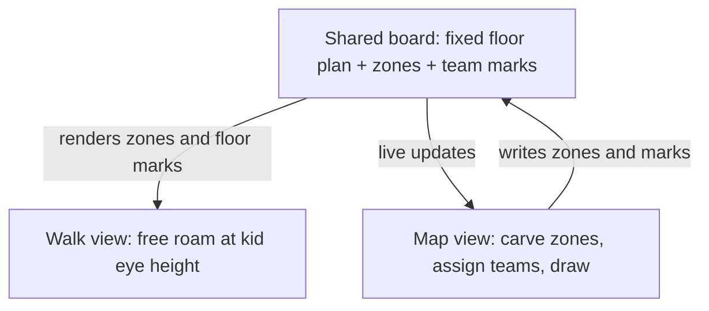
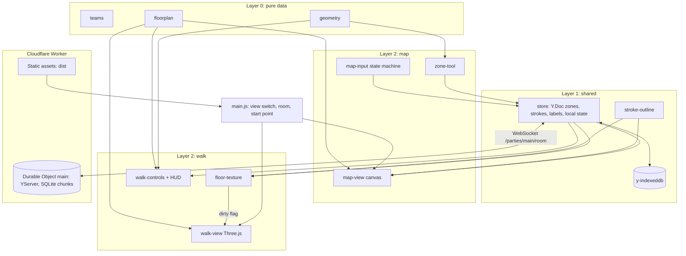
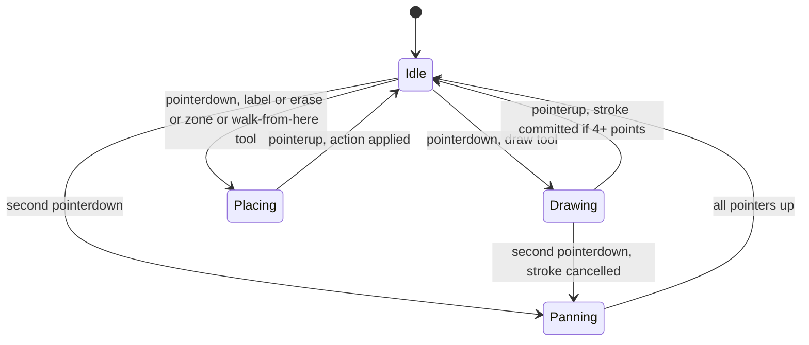
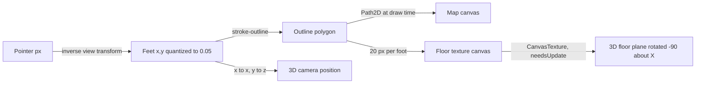

# Haunted House Layout Tool - Plan

## Goal Capsule

- **Objective:** Every team lead for the school haunted house can see their zone of the gym at real scale on their phone, mark it up for their team, and walk the whole house at a third grader's eye height, so that scare pacing and space use are judged from the space itself instead of guessed from a paper sketch.
- **Means:** One web page behind a shared link with two views of the same locked floor plan: a top-down map with team zones and freehand marker drawing, and a first-person free-roam walkthrough. Built as a single Cloudflare Worker project that serves the static app and runs the shared document (KTD1, KTD2, KTD14).
- **Product authority:** This plan owns the full v1 tool. Follow-ups named under Scope Boundaries (guided walk with timing, scare beats, concept art in 3D, sized props, walking together) are not active scope. The Product Contract wins on product behavior; the Planning Contract wins on mechanism within it.
- **Execution profile:** Greenfield web app, Node 22, no framework. Implementation units run in dependency order per the Unit Index: U2, U3, and U11 in parallel after U1; then U4 through U6 and U7 as two side-by-side chains; U8 joins both once U5 and U7 are done.
- **Stop conditions:** Stop and surface rather than guess if Cloudflare Durable Objects cannot run locally under `wrangler dev`, if Three.js cannot hold a smooth frame rate on the reference phone, or if any session-settled Key Decision proves unworkable.
- **Open blockers:** None. Real gym measurements are a dependency on the physical event, not on planning; see Dependencies / Assumptions.

---

## Product Contract

Product Contract preservation: unchanged in meaning and IDs. Sources extended with two build-night photos; the former Outstanding Questions were planning-owned and are resolved in Key Technical Decisions below.

### Summary

A phone-first web page behind one shared link where the gym floor plan is carved into six team zones, each team lead draws on the map with a finger in their team color, and anyone can walk the same space at a third grader's eye height with the marks painted on the floor. Zones, marks, and the walk stay in sync for everyone who opens the link.

### Problem Frame

The school haunted house runs in late October in the gym. Six teams each own a themed section under the theme "Secret World of Arrietty": the visitor is tiny and everyday school objects are giant. The floor plan is a hand-drawn sketch with dimensions, and the team concepts are a hand-drawn board. Nothing has been laid out at real scale, and team-to-zone assignment has not happened yet.

The moment of pain is scare pacing. Nobody can tell from the sketch how long a third grader spends in each section, what they can see coming, or where a reveal should land. Team leads plan in isolation from a photo of the sketch, and that guesswork surfaces only on build day, when it is too late to move anything cheaply.

### Key Decisions

- **Map and walkthrough ship together as one product.** (session-settled: user-approved — chosen over map-first or walkthrough-first releases: neither half alone is worth opening on a phone, and both share one layout.) Governs R10, R14.
- **The floor plan is fixed content.** Walls, tents, corridors, and the visitor path are locked for the event; the tool renders them and never lets users move them. Governs R1, R2.
- **Zones are assigned inside the tool.** Team-to-zone assignment is still open, so a coordinator carves and reassigns zones rather than the plan hardcoding a mapping. Governs R3, R4.
- **Freehand marker over sized footprints.** (session-settled: user-directed — chosen over named blocks sized in feet: expressiveness and speed on a phone matter more than marks that stand up in 3D.) Governs R5, R6, R7.
- **One shared live board with no accounts.** (session-settled: user-approved — chosen over per-team links or local-only boards: one source of truth for six teams outweighs the risk of someone erasing another team's marks.) Governs R8, R9, R16.
- **Walkthrough shows walls, zones, and floor marks only.** (session-settled: user-directed — chosen over concept art on the walls or scare beats on the path: the space itself is the point of v1.) Governs R10.
- **Free roam over a guided walk.** (session-settled: user-directed — chosen over an auto-walk along the visitor path with a clock: feeling the space and sightlines comes first; pacing stays a human judgment.) Governs R11, R12, R13.
- **A running clock and current zone name ride along in free roam.** The cheapest pacing aid that survives the free-roam choice. Governs R12.
- **Product shape is the two-view planner.** Chosen over walk-first marking inside the 3D world and over adding multi-phone presence in v1: team leads plan alone on phones, and a flat map is the fastest surface to mark up. Governs R14.



### Actors

- A1. **Team lead** — a parent or teacher who owns one zone. Opens the link on a phone, finds their zone, draws where props and scares go, and walks their zone to judge it. The primary user.
- A2. **Coordinator** — the organizer of the whole house. Carves the floor plan into zones, assigns teams, watches boundaries and transitions across all six zones.
- A3. **Meeting viewer** — anyone at a volunteer meeting looking at an iPad or a mirrored screen while someone else walks the house. Reads, does not edit.

### Requirements

**Floor plan and zones**

- R1. The map shows the gym floor plan from the sketch as a top-down drawing at one consistent real-world scale in feet: outer walls, stage and pony wall, both tent blocks, the diagonal wall, interior partitions, the right corridor wall, entrance, exit, and the dashed visitor path.
- R2. Users cannot move, add, or delete walls, tents, or the visitor path.
- R3. A coordinator can carve the floor plan into zones bounded by existing walls and the visitor path, assign each zone one of the six teams (Poison Breakfast, Hallway/Library, Lost & Found Playground, Schoolyard Dangers, Garden, Exit) with that team's color, and change any assignment at any time.
- R4. Every zone shows its team name and color, on the map and in the walk.

**Drawing**

- R5. Any user can draw freehand strokes and place short text labels anywhere on the map with one finger, in a chosen team color.
- R6. Marks belong to the team color they were drawn in; a user can show or hide each team's marks, undo their own recent marks, and erase any mark.
- R7. One finger draws; two fingers pan and zoom the map without drawing, on iPhone and iPad.

**Sharing**

- R8. Everyone who opens the link sees the same zones and marks, and a change made on one device appears on other open devices within a few seconds.
- R9. Zones and marks persist across visits and browser restarts without any sign-in.

**Walkthrough**

- R10. The walk view places the user inside the same floor plan at a third grader's eye height, with walls at realistic height, each zone's floor tinted in its team color, and marks painted on the floor exactly where they were drawn on the map.
- R11. The user moves and looks around with on-screen touch controls, and walls block movement.
- R12. The walk shows a running clock since the walk began and the name of the zone the user is standing in.
- R13. A walk starts at the entrance by default, and a user can also start it from a spot they tap on the map.
- R14. Map view and walk view switch in one tap and show the same zones and marks at all times.

**Devices and access**

- R15. The tool runs in the browser on iPhone and iPad in portrait and landscape, and on a desktop browser, with nothing to install.
- R16. Anyone with the link can do everything the tool offers; there are no accounts, roles, or passwords.

### Key Flows

- F1. Coordinator sets up zones
  - **Trigger:** The coordinator opens the link for the first time.
  - **Actors:** A2
  - **Steps:** The floor plan is shown with no zones. The coordinator outlines a zone along existing walls, picks a team for it, and repeats until the whole visitor path is covered. Later, the coordinator reassigns a zone to a different team.
  - **Outcome:** Six colored, named zones, visible to everyone on the next refresh.
  - **Covered by:** R1, R3, R4, R8

- F2. Team lead marks up their zone
  - **Trigger:** A team lead opens the link on their phone during the week.
  - **Actors:** A1
  - **Steps:** They find their zone by color and name, pinch to zoom in, pick their team color, draw where the giant props and scares go, and add a text label or two. A stray stroke is undone.
  - **Outcome:** Their marks appear on every other open device within seconds and are still there the next day.
  - **Covered by:** R5, R6, R7, R8, R9

- F3. Walk the house at kid height
  - **Trigger:** Any user taps the walk view.
  - **Actors:** A1, A2, A3
  - **Steps:** The user starts at the entrance at a third grader's eye height, walks the tents, the diagonal corridor, the serpentine, and the right corridor using touch controls, sees each zone's color underfoot and the team's marks on the floor, and watches the clock and zone name change as they go. Walls stop them.
  - **Outcome:** A felt sense of sightlines, corridor lengths, and time per zone.
  - **Covered by:** R10, R11, R12, R13, R14

- F4. Meeting walkthrough
  - **Trigger:** A volunteer meeting with an iPad passed around or mirrored to a screen.
  - **Actors:** A2, A3
  - **Steps:** The coordinator taps a spot on the map to start the walk inside a zone under discussion, walks it while people watch, and switches back to the map to point at marks.
  - **Outcome:** The group is imagining the same space.
  - **Covered by:** R13, R14, R15

### Acceptance Examples

- AE1. **Covers R3, R4.** Given the Garden zone is assigned to the right corridor, when the coordinator reassigns that zone to Schoolyard Dangers, then the corridor changes to the red team color and label on every open map and in the walk.
- AE2. **Covers R5, R8.** Given two phones have the link open, when one draws a green stroke inside the entrance tents, then the other phone shows the same stroke in the same place within a few seconds without reloading.
- AE3. **Covers R6.** Given marks from three teams overlap in the serpentine, when a user hides the purple team's marks, then only the purple marks disappear on that user's device and nothing is deleted for anyone else.
- AE4. **Covers R6, R16.** Given a mark drawn by another team, when a user erases it, then it is gone for everyone, with no prompt for permission.
- AE5. **Covers R7.** Given the map is zoomed out, when a user places two fingers and pinches, then the map zooms and no stroke is drawn.
- AE6. **Covers R10, R14.** Given a text label "milk carton lurker" drawn in the entrance tents, when a user walks into that tent, then the same label is visible on the floor at that spot.
- AE7. **Covers R11.** Given the user walks toward the diagonal wall, when they reach it, then they stop at the wall and cannot pass through it.
- AE8. **Covers R12, R13.** Given the user starts a walk from the entrance, when they enter the second zone, then the zone name changes and the clock keeps counting from the walk's start.
- AE9. **Covers R9.** Given marks and zones exist, when every device closes the page and one reopens it the next day, then all zones and marks are still there.

### Success Criteria

- All six team leads have drawn in their zone before build day.
- The group has walked the house at kid height together in at least one volunteer meeting.
- A first-time user on an iPhone can find their zone and draw a stroke within a minute with no instructions.
- The walk feels smooth on a few-year-old iPhone, not a slideshow.

### Scope Boundaries

**Deferred for later**

- Guided walk along the visitor path at a kid's pace with a timeline of time per zone.
- Named scare moments on the path that show as beats while walking.
- Team concept board art shown on the walls of each zone in the walk.
- Placeable objects with real sizes and a library of ideas per zone; the objects-and-ideas follow-up the organizer named.
- Multiple phones in the same walk at once, seeing each other as kid-height figures.
- Export, print, or snapshot of the map.

**Outside this product's identity**

- A general floor planner or CAD tool; the floor plan is fixed content for this one event.
- A game for kids; the walk exists to judge the space, not to entertain.
- Accounts, roles, or permissions of any kind.

**Deferred to Follow-Up Work**

- Drawing while standing in the walk view.
- Any rate limiting or abuse protection on the open room; see KTD3.
- Undo for zone edits; zone delete asks for confirmation instead (KTD8).
- A lighting mode that previews the darkened house; v1 lights the scene evenly.

### Dependencies / Assumptions

- The sketch's dimensions do not reconcile: a 32 foot diagonal cannot span most of an 85 foot room. The tool starts from the sketch's proportions, and someone measures the gym before anyone builds to the tool's numbers.
- Third grader eye height is taken as 4 feet.
- A trusted group of parent and teacher volunteers uses the link; nobody expects protection from another team's edits.
- Phones have Wi-Fi or cellular data when in use, including during meetings in the gym.
- Six teams and six concepts, as on the concept board; the theme is Secret World of Arrietty.
- The repository holds no application code yet; everything here is net new.

### Sources

- `docs/plans/assets/gym-floor-plan-sketch.jpg`: the hand-drawn floor plan with dimensions (85 by 60 feet, 50 foot pony wall, two tent blocks of three 10 foot tents each for six tents in total, 32 foot diagonal with 8 foot panels, right corridor with 8 foot panels, dashed visitor path). The named regions along the path, in walk order, are the entrance tents, the diagonal corridor, the serpentine of interior partitions, the right corridor, and the exit tents.
- `docs/plans/assets/team-concept-board.jpg`: the six team concepts with their marker colors: Poison Breakfast (green), Hallway/Library (blue), Lost & Found Playground (purple), Schoolyard Dangers (red), Garden (yellow), Exit (pink).
- `docs/plans/assets/gym-build-wall-frames.jpg` and `docs/plans/assets/gym-build-black-sheeting.jpg`: build-night photos of the real gym. Walls are 2x4 stud frames about 8 feet wide and 8 feet tall sheeted in black plastic with open tops, the tents are 10 by 10 pop-up canopies, the floor is tan Ram Board, and the stage with its blue curtain sits along one long wall.

---

## Planning Contract

### Key Technical Decisions

- KTD1. **One Cloudflare Worker project serves the app and runs the shared document.** Static assets and a Durable Object running y-partyserver's `YServer` deploy with one `wrangler deploy` on the free plan, which since April 2025 includes Durable Objects with SQLite storage and WebSocket hibernation. Chosen over Firebase Realtime Database (no server code, but a 100-connection cap and world-writable rules), Supabase Realtime (free projects pause after 7 idle days, a trap between build week and event night), Liveblocks (10 connections per room), and a self-hosted Node WebSocket server (no free host with durable disk remains in 2026). Routing is pinned: the Durable Object binding is named `main` so `YProvider`'s default party name matches, `wrangler.toml` declares `[assets] directory = "./dist"`, `binding = "ASSETS"`, and the Worker's fetch returns `routePartykitRequest(request, env)` or else `env.ASSETS.fetch(request)`. The `YServer` subclass sets `static options = { hibernate: true }` and explicit `callbackOptions` debounce values, and rebuilds the document in `onLoad` because a hibernated object restarts. Verified locally: under `wrangler dev` the asset root returns 200 and a WebSocket upgrade on `/parties/main/gym` returns 101. Governs the mechanism for R8, R9, R16. Instantiates the shared-board Key Decision.
- KTD2. **Yjs is the document model; strokes are append-only and compact.** Zones live in a `Y.Map`, strokes and labels in `Y.Array`s. Two people drawing at once both keep their strokes, an erase deletes one stroke by id, and y-indexeddb keeps a local copy so reload is instant and offline strokes merge on reconnect. Chosen over a plain WebSocket broadcast with a JSON log on the Durable Object because Yjs gives offline merge, local persistence, and the server for free through y-indexeddb and y-partyserver. Stroke points are quantized to twentieths of a foot and stored as integers, and pressure is stored only for pen input, so a 200-point stroke encodes under 1.5 KB. A zone is a plain object in the map, so two simultaneous edits to the same zone keep the later one; that is acceptable for a single coordinator. Governs the mechanism for R6, R8, R9 and Acceptance Examples AE2, AE4, AE9.
- KTD3. **Rooms are named by a query parameter with no auth.** The shared link is the plain site URL and opens room `gym`; `?room=rehearsal` opens a separate board for rehearsal. A query parameter keeps every page load on `/`, so the static asset serves without single-page-application fallback and `/parties/*` always reaches the Worker. Abuse protection is deferred (Scope Boundaries) because the audience is a trusted volunteer group.
- KTD4. **Vite bundles a vanilla JavaScript client; no UI framework.** Three.js, Yjs, y-partyserver, y-indexeddb, perfect-freehand, and nipplejs are exact-pinned npm dependencies bundled by `vite build` into `dist/`, which is the Worker's asset directory; `publicDir` is off so the default static-copy folder cannot collide. Chosen over CDN import maps because y-partyserver's client pulls transitive packages that CDN import maps resolve unreliably, and over React or Svelte because the app is two canvases and a toolbar. The walk view is a dynamic import so the map loads without Three.js. Pins verified in a scratch install: three 0.186.0, yjs 13.6.32, y-partyserver 2.2.0, y-indexeddb 9.0.12, perfect-freehand 1.2.3, nipplejs 1.0.4, vite 8.2.2, vitest 5.0.0, @playwright/test 1.63.0, wrangler 4.130.0, @napi-rs/canvas 1.0.8. `.npmrc` sets `legacy-peer-deps=true` because wrangler 4.130 and y-partyserver 2.2 disagree on the optional `@cloudflare/workers-types` major, which plain JavaScript never uses.
- KTD5. **Three.js renders the walk; controls are joystick plus drag-to-look.** Three.js r186 is about 170 kB gzipped tree-shaken versus about 1.4 MB for Babylon.js, and box walls need nothing more. iOS Safari has no Pointer Lock API, so `PointerLockControls` is out: a nipplejs joystick on the left half of the screen moves, a pointer drag on the right half looks. Pixel ratio is capped at 2, movement uses delta time because Safari Low Power Mode caps frames at 30 per second, and the scene rebuilds on `webglcontextrestored` because iOS drops WebGL contexts on backgrounding. Governs the mechanism for R10, R11.
- KTD6. **All coordinates are feet in floor space; the 3D floor is a canvas texture of the map.** The map origin is the top-left corner of the sketch, x to the right and y down. The floor plane is rotated minus 90 degrees about X so map x maps to 3D x, map y maps to 3D z, and up is y; a stroke at feet (10, 10) lands at world (10, 0, 10). Strokes store quantized feet points, so one outline module draws them on the 2D map and onto an offscreen canvas at 20 pixels per foot (1700 by 1200) that becomes the floor texture with anisotropic filtering at the renderer's maximum. Label text is sized in feet (1.5 foot cap height) so it reads the same on the map and underfoot. This is what makes AE6 hold without a second data model.
- KTD7. **Marks are independent of zones.** A stroke or label keeps its own team color and position forever; carving, reassigning, or deleting a zone never moves, recolors, or deletes a mark. Drawing works before any zone exists. Governs the mechanism for R3, R6 and AE1.
- KTD8. **Undo is local to the browser session; erase is global; both cover strokes and labels.** Undo pops the ids of marks this tab created since page load and deletes them from the shared arrays; a reload clears the undo stack. Erase removes any stroke or label for everyone. Deleting a zone asks for confirmation because a zone carries structure a single mark does not, and no undo covers it. There is no identity to scope undo more widely (R16).
- KTD9. **Walls render as 8 foot tall black panels under an open gym volume; tents are open canopies.** From the build photos: 2x4 frames about 8 feet wide and tall, sheeted black, no ceiling on the maze, floor Ram Board tan. Tents are 10 by 10 pop-up canopies rendered as four legs and a low off-white roof at 7 feet with open sides, and they are not collision walls, because the visitor path runs through both tent blocks. The gym box is 85 by 60 by 24 feet. A 4 foot camera cannot see over the walls, which is the point of the kid-height view.
- KTD10. **The map input is a pointer-count state machine.** One pointer down draws; a second pointer down cancels the in-progress stroke (discarded if under 4 points) and switches to pan and zoom until all pointers lift. `touch-action: none` on the canvas and best-effort pointer capture on down, wrapped so a synthetic pointer without capture support does not abort the handler. Safari's one-input-type-at-a-time rule gives palm rejection for Apple Pencil. "Walk from here" is a toolbar tool whose tap routes through the Placing state, not a long press, so it never collides with drawing. Governs the mechanism for R7, R13 and AE5.
- KTD11. **Verification is Vitest for logic and Playwright against a static preview for the browser.** Geometry, store semantics, the input state machine, the stroke outline, and the floor texture are pure modules under test; the texture tests use `@napi-rs/canvas`, which ships `Path2D` and `getImageData` for Node, because jsdom has neither. The browser smoke test runs Chromium against `vite preview` with sync unavailable, which also proves the offline path; the pinch gesture is dispatched through a CDP session with two touch points because Playwright's touchscreen API has only tap, and headless WebGL runs with SwiftShader flags. `wrangler dev` runs the Durable Object locally for sync checks, and the Vite dev server proxies `/parties` to it with WebSocket support so both tabs share one origin.
- KTD12. **The Durable Object class name and room string are the board's storage key.** Storage is addressed by class plus `idFromName(room)`; renaming the class without a `renamed_classes` migration, or changing the room mapping, silently orphans the board. Persistence writes the document as chunks under 1 MB in a SQLite table keyed by sequence because a single key plus value cannot exceed 2 MB, and a failed save is written into a `meta` map entry the toolbar shows rather than only logged. The README names the class, the room mapping, and the migration tag.
- KTD13. **The store emits synchronously; each view owns its own frame loop.** The store notifies subscribers once per Yjs transaction and on local state changes such as team visibility. The map view owns one coalesced `requestAnimationFrame` redraw. The walk view owns `renderer.setAnimationLoop`, stopped while hidden. The floor texture owns no loop: it sets a dirty flag the walk loop consumes, so drawing on the map never rasterizes the texture while the walk is hidden.
- KTD14. **Modules are layered and the two views never import each other.** Layer 0: `teams`, `floorplan`, `geometry` (pure). Layer 1: `store`, `stroke-outline` (no view imports). Layer 2: `map/*` and `walk/*`, which import Layers 0 and 1 only. Layer 3: `main.js`, which mediates view switching and hands the walk start point from the map to the walk through store-local state. Tests import Layers 0 through 2 directly.

### High-Level Technical Design

Components, layers, and where data flows (KTD13, KTD14):



Map input state machine (KTD10):



Coordinate and rendering pipeline (KTD6):



### Assumptions

Un-validated bets made without a user in the loop; correct them in review rather than treating them as settled.

- Marks are independent of zones and drawing is allowed before zones exist (KTD7).
- Undo covers only this tab's marks since page load (KTD8).
- Concurrent strokes from two devices both survive; only an explicit erase removes a mark (KTD2).
- A stroke drawn offline is kept locally and merged on reconnect; the toolbar shows the sync state as a dot plus a short word (connecting, live, offline, local) so it does not rely on color alone.
- Text labels are capped at 40 characters, entered in an in-page input anchored near the tap with commit and cancel controls; an empty label is discarded, and the map scrolls the anchor into view above the keyboard.
- Walk speed is 3 feet per second, wall height 8 feet, camera height 4 feet, collision radius 0.75 feet; movement is substepped so no step exceeds 0.2 feet.
- Zone polygons are drawn by tapping corners, snapped to a 1 foot grid and to wall endpoints within 1.5 feet, and closed by tapping the first corner; the zone tool also offers the five named regions of the floor plan as one-tap starting outlines.
- The HUD shows "No zone" in a neutral color when the walker is outside every zone.
- Both views support portrait and landscape; the walk controls reposition in landscape.
- The floor plan geometry is traced from the sketch's proportions (see Dependencies / Assumptions) and lives in one data file so a measured correction is a one-file change.
- Zone lookup for the HUD and floor tint is point-in-polygon on the zone list; overlapping zones resolve to the most recently created.

### Open Questions

**Deferred to Implementation**

- Exact perfect-freehand size, thinning, and streamline values that feel right on an iPhone; tune on device.
- Whether the walk needs a fog or vignette to keep the open gym ceiling from dominating the view at kid height.
- Whether `wrangler dev` local Durable Object storage survives restarts well enough for rehearsal, or whether rehearsal runs against the deployed Worker.

### System-Wide Impact

- **Data lifecycle:** the Durable Object's SQLite holds the only server copy of the board. It has no export; the y-indexeddb copy on each phone is the informal backup. Losing the Cloudflare account loses the board. A save that fails is visible in the toolbar (KTD12).
- **Concurrency:** Yjs makes concurrent edits converge; the only last-write-wins surface is a zone's fields, one plain object per zone (KTD2).
- **Performance posture:** the floor texture re-renders on any mark change; at 1700 by 1200 pixels that is cheap but is gated by the walk loop's dirty flag (KTD13).
- **Free-tier duration:** hibernation is on (KTD1); an idle room costs nothing, and the README dry run checks the dashboard shows the object idle after all tabs close.

### Risks & Dependencies

- **Cloudflare account and free-tier limits.** Mitigation: the deploy guide in U9 names the Durable Object migration and free-plan check; a September dry run confirms nothing paused.
- **Board exceeds storage limits.** Mitigation: chunked saves and quantized points (KTD2, KTD12); a save failure is surfaced, not silent.
- **iOS WebGL context loss.** Mitigation: rebuild the scene on restore (KTD5) and show a tap-to-reload overlay if restore fails.
- **Ghost strokes on pinch.** Mitigation: the state machine cancels the stroke on the second pointer (KTD10) and the e2e test pinches after drawing.
- **Sketch dimensions do not reconcile.** Mitigation: geometry lives in one file with a comment naming the measured values still needed; the diagonal is placed by the sketch's proportions, not its 32 foot label.
- **Dependency drift before October.** Mitigation: exact pins in `package.json` and a committed lockfile.
- **Last seconds of edits lost on eviction.** `onSave` is debounced; edits inside the debounce window live only in clients' IndexedDB until they reconnect. Accepted for v1; the debounce maximum wait is 5 seconds.

### Sources / Research

- Cloudflare Durable Objects free tier (April 2025 changelog): 100k requests per day, 5 GB SQLite, hibernation; storage key plus value limit of 2 MB. Shapes KTD1, KTD12.
- `cloudflare/partykit` repository, `packages/y-partyserver` (v2.2.0): `YServer` with `onLoad` and `onSave`, `YProvider` client defaulting to party `main`, rooms named by URL, `hibernate` option on partyserver. Shapes KTD1, U9.
- Three.js 0.186.0 on npm; bundle comparison versus Babylon.js and PlayCanvas; Three.js discourse threads on iOS context loss; Pointer Lock unsupported on iOS through v26. Shapes KTD5.
- perfect-freehand 1.2.3 README; Apple developer forum threads on one-input-type-at-a-time and Pencil sampling; MDN `touch-action`. Shapes KTD10, U5.
- nipplejs 1.0.4 on npm (multitouch joystick). Shapes U8.
- Supabase free-project pausing and Realtime limits; Firebase Spark limits; Liveblocks plan limits; Glitch shutdown and Fly.io, Railway, Render free-tier status in 2026. Shapes KTD1's rejected alternatives.
- Local probes in this session: scratch install of the pinned stack, a Vitest run, a Vite build of Three.js plus Yjs plus the y-partyserver provider, `wrangler dev` serving assets and accepting a WebSocket upgrade on a `YServer` Durable Object, and `@napi-rs/canvas` filling a `Path2D` and reading pixels under Node. Shapes KTD4, KTD11.
- Spec-flow analysis and document review of this plan (marks versus zones, offline strokes, concurrent drawing, undo scope, labels under erase and hide, HUD outside zones, storage limits, dev-server origins, Playwright pinch). Shapes KTD2, KTD7, KTD8, KTD11, KTD12 and the Assumptions.

---

## Output Structure

```text
package.json                 scripts: dev, dev:worker, build, preview, test, e2e, deploy
.npmrc                       legacy-peer-deps=true (KTD4)
vite.config.js               outDir dist, publicDir false, /parties proxy to wrangler dev
vitest.config.js
playwright.config.js         runs against vite preview; mobile and desktop projects
wrangler.toml                assets dist + ASSETS binding + main Durable Object + migration
index.html                   app shell: toolbar, map canvas, walk canvas, HUD, label input
src/
  main.js                    boot, room from query, view switching, start point handoff
  teams.js                   six teams, names, colors
  floorplan.js               fixed geometry in feet: walls, tents, stage, path, entrance, exit, named regions
  geometry.js                point-in-polygon, segment distance, snapping, substepped circle-vs-wall slide
  store.js                   Y.Doc shape, provider + indexeddb wiring, mark/zone ops, undo, visibility, status
  stroke-outline.js          perfect-freehand outline in feet, label metrics, draw helpers
  map/
    map-view.js              canvas renderer + view transform (pan, zoom, feet to px)
    map-input.js             pointer-count state machine, tools
    zone-tool.js             polygon carving, region presets, team assignment, confirmed delete
    toolbar.js               team picker, tools, team visibility, undo, sync status, view switch
  walk/
    floor-texture.js         offscreen canvas: zone tints + strokes + labels at 20 px/ft, dirty flag
    walk-view.js             Three.js scene: gym box, walls, canopies, stage, floor plane, context loss
    walk-controls.js         joystick, drag-look, collision, clock + zone HUD, start points
  styles.css                 dvh layout, safe areas, portrait/landscape rules
worker/
  index.js                   YServer Durable Object (hibernating, chunked SQLite save) + ASSETS fallthrough
test/
  geometry.test.js
  floorplan.test.js
  store.test.js
  stroke-outline.test.js
  map-view.test.js
  map-input.test.js
  zone-tool.test.js
  floor-texture.test.js
  walk-view.test.js
  walk-controls.test.js
e2e/
  smoke.spec.js
.github/workflows/ci.yml     install, test, build, e2e
README.md                    run, test, deploy guide
```

---

## Implementation Units

### Unit Index

| U-ID | Title | Key files | Depends on |
|---|---|---|---|
| U1 | Scaffold the project and CI | `package.json`, `vite.config.js`, `wrangler.toml`, `index.html`, `.github/workflows/ci.yml` | none |
| U2 | Floor plan data and geometry helpers | `src/floorplan.js`, `src/geometry.js`, `src/teams.js` | U1 |
| U3 | Shared document store | `src/store.js` | U1 |
| U11 | Stroke outline module | `src/stroke-outline.js` | U1 |
| U4 | Map view renderer | `src/map/map-view.js` | U2, U3, U11 |
| U5 | Map input and drawing tools | `src/map/map-input.js`, `src/map/toolbar.js` | U4 |
| U6 | Zone tool | `src/map/zone-tool.js` | U5 |
| U7 | Walk scene and floor texture | `src/walk/floor-texture.js`, `src/walk/walk-view.js` | U2, U3, U11 |
| U8 | Walk controls, HUD, and view switching | `src/walk/walk-controls.js`, `src/main.js` | U7, U5 |
| U9 | Sync server on Cloudflare | `worker/index.js`, `wrangler.toml`, `README.md` | U3, U5 |
| U10 | Browser smoke tests and device checklist | `e2e/smoke.spec.js`, `README.md` | U6, U8, U9 |

Sequencing: U2, U3, and U11 run in parallel after U1. U4 through U6 and U7 then run as two side-by-side chains. U8 joins both chains once U5 and U7 are done. U9 needs U5 for its two-tab check. U10 closes.

### U1. Scaffold the project and CI

- **Goal:** A runnable empty app with test, build, preview, and CI wiring so every later unit lands on green.
- **Requirements:** R15 (browser-only, nothing to install); KTD4.
- **Dependencies:** none.
- **Files:** `package.json`, `.npmrc`, `vite.config.js`, `vitest.config.js`, `playwright.config.js`, `wrangler.toml`, `index.html`, `src/main.js`, `src/styles.css`, `.github/workflows/ci.yml`, `.gitignore` (add `dist/`, `.wrangler/`, `playwright-report/`, `test-results/`), `README.md`.
- **Approach:**
  1. `package.json` with the exact pins in KTD4; `.npmrc` with `legacy-peer-deps=true`.
  2. `vite.config.js`: `build.outDir` `dist`, `publicDir` `false`, `server.proxy` sending `/parties` to `http://localhost:8787` with `ws: true` and `changeOrigin: true`, and `build.chunkSizeWarningLimit` raised because the walk chunk carries Three.js.
  3. `wrangler.toml` per KTD1 with the `main` binding, `Board` class, and a `v1` migration in `new_sqlite_classes`.
  4. `index.html` carries the two canvases, toolbar, HUD, and a hidden label input as empty shells; `main.js` toggles which view is visible.
  5. Scripts: `dev` (vite), `dev:worker` (`wrangler dev --port 8787`), `build`, `preview`, `test` (`vitest run`), `e2e` (`playwright test`), `deploy` (`vite build && wrangler deploy`).
  6. CI workflow: Node 22, `npm ci`, `npm test`, `npm run build`, install Playwright Chromium, `npm run e2e`.
- **Execution note:** Pure scaffolding; prove it by a passing empty Vitest run, a successful `vite build`, and `wrangler deploy --dry-run`.
- **Patterns to follow:** none in repo; keep scripts plain npm scripts.
- **Test scenarios:** Test expectation: none -- scaffolding with no behavior; verification is the build, the dry run, and an empty test run passing locally and in CI.
- **Verification:** `npm test`, `npm run build`, and `npx wrangler deploy --dry-run` succeed; the CI workflow runs on the PR.

### U2. Floor plan data and geometry helpers

- **Goal:** The locked floor plan in feet and the pure geometry the map, zones, and walk all share.
- **Requirements:** R1, R2, R11 (collision), R12 (zone lookup); KTD6, KTD9.
- **Dependencies:** U1.
- **Files:** `src/floorplan.js`, `src/geometry.js`, `src/teams.js`, `test/floorplan.test.js`, `test/geometry.test.js`.
- **Approach:**
  1. `teams.js` exports the six teams with ids, names, and hex colors from the concept board.
  2. `floorplan.js` exports the gym as data: bounds 85 by 60; wall segments with thickness 0.3 feet and height 8 (outer walls, pony wall, the diagonal wall from (20,36) to (60,12) placed by the sketch's proportions, three partitions, the right corridor wall at x 64 from y 24 to 56); six tent squares in two blocks of three, not in the wall list; stage rectangle; entrance and exit rectangles; the visitor path polyline; and five named regions as polygons: entrance tents, diagonal corridor (the space along the diagonal wall), serpentine (the partitioned area between the diagonal wall and the stage), right corridor, exit tents. A comment names which dimensions came from the sketch and still need measuring.
  3. `geometry.js`: `pointInPolygon`, `distancePointToSegment`, `snapPoint(point, grid, anchors, radius)`, `slideCircleAlongWalls(position, delta, radius, walls)` that substeps any move longer than 0.2 feet and returns the resolved position, and `zoneAt(point, zones)` picking the most recently created match.
- **Patterns to follow:** plain ES modules, no classes needed.
- **Test scenarios:**
  - Happy path: a point inside the entrance tent block is inside a rectangle polygon covering it; a point on the stage is not.
  - Happy path: the floor plan exports 85 by 60 bounds, at least 9 wall segments, 6 tents in two blocks, five named regions, and a path starting at the entrance and ending at the exit.
  - Edge: `pointInPolygon` on a polygon vertex and on an edge returns a stable answer (document which) and does not throw.
  - Edge: `snapPoint` prefers a wall endpoint within 1.5 feet over the grid, and falls back to the 1 foot grid otherwise.
  - Happy path: `slideCircleAlongWalls` moving a 0.75 foot circle straight into the diagonal wall stops short of it and moving parallel to it passes freely.
  - Edge: a delta of zero returns the same position; a 3 foot delta in one call is substepped and still stops at the wall.
  - Happy path: `zoneAt` returns the newest zone when two overlap and `null` outside every zone.
- **Verification:** All geometry tests pass; the floor plan module has no runtime dependencies.

### U3. Shared document store

- **Goal:** One module that owns the Yjs document, its sync and local persistence, and every mutation the UI performs.
- **Requirements:** R6, R8, R9, R16; KTD2, KTD7, KTD8, KTD13; AE2, AE3, AE4, AE9.
- **Dependencies:** U1.
- **Files:** `src/store.js`, `test/store.test.js`.
- **Approach:**
  1. `createStore({ doc, provider, persistence })` so tests inject a bare `Y.Doc` and `main.js` injects `YProvider` plus `IndexeddbPersistence`; the store never reads `location` or the DOM.
  2. Shape: `zones` is a `Y.Map` keyed by id holding `{ name, team, points: [[x,y]...], createdAt }`; `strokes` and `labels` are `Y.Array`s of plain objects with `id`, `team`, and quantized feet coordinates; strokes carry `points` as integers in twentieths of a foot with an optional pressure array for pen input, plus `size`; `meta` is a `Y.Map` the server uses for `lastSaveError`.
  3. Operations: `addStroke`, `addLabel`, `erase(id)` for strokes and labels, `undo()` (session stack of ids this store created, strokes and labels), `setZone`, `assignZone(id, team)`, `deleteZone(id)`, `setTeamVisible(team, bool)` (local only), `setWalkStart(point)` (local only), and `subscribe(fn)` firing synchronously once per transaction and on local state changes (KTD13).
  4. Sync status: expose `status` of `connecting`, `live`, `offline` from provider events, `local` without a provider, and `saveError` mirrored from `meta`.
- **Execution note:** Test-first with an in-memory `Y.Doc`; two docs joined by applying each other's updates simulate two phones.
- **Patterns to follow:** Yjs transactions for multi-key writes.
- **Test scenarios:**
  - Happy path: `addStroke` on doc A appears in doc B after exchanging updates, with identical points and team.
  - Happy path: concurrent `addStroke` on A and B both survive after merge. Covers AE2.
  - Happy path: `erase(id)` on B removes a stroke A drew, on both docs; the same for a label. Covers AE4.
  - Happy path: `undo()` removes only the last mark this store created, works for a label as well as a stroke, and does nothing when the stack is empty or when the mark was already erased.
  - Edge: `undo()` after a mark created by the other doc leaves that mark alone.
  - Happy path: `setTeamVisible('garden', false)` changes only local visibility, notifies subscribers, and emits no document update. Covers AE3.
  - Happy path: `assignZone` overwrites the team of one zone and leaves strokes inside it untouched. Covers AE1 and KTD7.
  - Happy path: `deleteZone` removes the zone and no marks.
  - Edge: `addLabel` with an empty or whitespace string is rejected; text longer than 40 characters is truncated.
  - Edge: a 200-point stroke encodes as a Yjs update under 1.5 KB.
  - Integration: persisting doc A's update to a fresh doc C reproduces every zone, stroke, and label. Covers AE9.
- **Verification:** Store tests pass; the module imports nothing from the DOM so it runs under Node.

### U11. Stroke outline module

- **Goal:** One pure module that turns quantized stroke points into a drawable outline and lays out label text, shared by the map and the floor texture.
- **Requirements:** R5, R10; KTD6, KTD14.
- **Dependencies:** U1.
- **Files:** `src/stroke-outline.js`, `test/stroke-outline.test.js`.
- **Approach:**
  1. `strokeOutline(points, size)` decodes twentieths of a foot to feet and returns a closed outline polygon in feet from `perfect-freehand`'s `getStroke`, or `null` for fewer than 2 points.
  2. `drawOutline(ctx, outline, scale)` builds a `Path2D` at draw time and fills it; `drawLabel(ctx, label, scale)` draws text with a halo at a 1.5 foot cap height.
  3. No imports from `map/` or `walk/`.
- **Patterns to follow:** perfect-freehand README rendering example.
- **Test scenarios:**
  - Happy path: a 3 point stroke yields a closed outline with more points than the input.
  - Edge: a 1 point stroke yields `null`; a 2 point stroke yields an outline.
  - Happy path: `drawOutline` on a `@napi-rs/canvas` context fills pixels along the stroke and not far from it.
  - Happy path: `drawLabel` places text so its cap height equals 1.5 feet times the scale.
- **Verification:** Tests pass under Node.

### U4. Map view renderer

- **Goal:** Draw the floor plan, zones, strokes, and labels on a canvas with pan and zoom in feet.
- **Requirements:** R1, R4, R5 (rendering), R6 (hidden teams), R7 (transform); KTD6, KTD13.
- **Dependencies:** U2, U3, U11.
- **Files:** `src/map/map-view.js`, `test/map-view.test.js`, `index.html`.
- **Approach:**
  1. A `ViewTransform` holding `scale` (px per foot) and `offset`, with `toFeet(px)` and `toPx(feet)` and `fitToBounds()`.
  2. The renderer draws in order: floor, zone fills at 25 percent alpha with name labels at the centroid, walls, tents, stage, path, then strokes and labels by team, skipping hidden teams for both, then the in-progress stroke.
  3. Redraw is scheduled once per animation frame on store change or transform change (KTD13); `devicePixelRatio` sizes the backing store.
- **Patterns to follow:** `stroke-outline.js` for every mark; no mark drawing code in this module.
- **Test scenarios:**
  - Happy path: `toPx(toFeet(p))` round-trips within a pixel at several scales.
  - Happy path: `fitToBounds` on a 400 by 300 canvas fits 85 by 60 feet with margin and centers it.
  - Edge: a hidden team's strokes and labels are both skipped by the draw list builder.
  - Happy path: two store notifications within one frame schedule a single redraw.
- **Verification:** Unit tests pass; `npm run dev` shows the traced floor plan with the six-color legend and no marks.

### U5. Map input and drawing tools

- **Goal:** Finger drawing, labels, erase, undo, team picking, the one-finger versus two-finger rule, and the sync status readout.
- **Requirements:** R5, R6, R7; KTD8, KTD10; AE5.
- **Dependencies:** U4.
- **Files:** `src/map/map-input.js`, `src/map/toolbar.js`, `test/map-input.test.js`, `src/styles.css`, `index.html`.
- **Approach:**
  1. `createInputMachine({ onStrokeStart, onStrokePoint, onStrokeEnd, onStrokeCancel, onPan, onZoom, onTap })` as a pure state machine over pointer events with the states in the High-Level Technical Design; it tracks active pointers in a map and never touches the DOM.
  2. Wire it to the map canvas with `touch-action: none`, best-effort `setPointerCapture` inside a try block, and `pointercancel` handling.
  3. Tools: draw, label, erase, walk-from-here (U8 consumes the point), undo button, team picker chips, per-team visibility toggles, and the walk button. Erase hit-tests the nearest stroke or label within 1 foot.
  4. Label entry: the hidden input in `index.html` is positioned near the tap, focused, capped at 40 characters, with commit on enter or a done button and cancel on escape or a cancel button; the map scrolls the anchor above the keyboard using `visualViewport`.
  5. Pinch: distance between two pointers scales around their midpoint; drag of two pointers pans.
  6. Sync status: a dot plus a short word for connecting, live, offline, and local, and a warning row when `saveError` is set.
- **Execution note:** Test the state machine first with synthetic pointer sequences; the DOM wiring is a thin layer verified in U10's browser test.
- **Patterns to follow:** pointer-to-feet through the view transform from U4.
- **Test scenarios:**
  - Happy path: down, three moves, up in draw mode emits start, points, and end with 4 points.
  - Happy path: down, one move, second pointer down cancels the stroke and enters panning; moving both emits pan and zoom; all up returns to idle. Covers AE5.
  - Edge: a stroke with fewer than 4 points on up is cancelled, not committed.
  - Edge: `pointercancel` mid-stroke discards the stroke and returns to idle.
  - Edge: a third pointer is ignored while panning.
  - Happy path: in erase mode a tap within 1 foot of a stroke or a label returns that mark's id; farther away returns nothing.
  - Happy path: walk-from-here tool tap routes through Placing and reports the feet point.
  - Error path: a label of only spaces is rejected before reaching the store.
- **Verification:** State machine tests pass; on a phone or Playwright touch emulation, one finger draws and two fingers zoom without leaving a ghost stroke.

### U6. Zone tool

- **Goal:** The coordinator carves zones along walls and assigns or reassigns teams.
- **Requirements:** R3, R4; KTD7, KTD8; AE1; F1.
- **Dependencies:** U5.
- **Files:** `src/map/zone-tool.js`, `test/zone-tool.test.js`, `src/map/toolbar.js`.
- **Approach:**
  1. Zone mode on the toolbar: each tap adds a corner snapped by `snapPoint` to the 1 foot grid and wall endpoints; tapping the first corner closes the polygon; a team sheet then assigns the zone. The sheet also lists the five named regions from `floorplan.js` as one-tap starting outlines.
  2. Tapping inside an existing zone in zone mode opens the same sheet with reassign and delete; delete asks for confirmation (KTD8).
  3. Polygons with fewer than 3 corners are discarded; self-intersecting polygons are allowed but warned in the sheet.
  4. Zone names default to the team name and are editable in the sheet.
- **Patterns to follow:** the input machine's tap callback from U5.
- **Test scenarios:**
  - Happy path: four taps around the entrance tents then a tap on the first corner produce a closed 4 corner polygon snapped to whole feet.
  - Happy path: choosing the "serpentine" region preset produces a zone with that region's polygon.
  - Happy path: assigning Garden then reassigning to Schoolyard Dangers updates the store's zone team and leaves strokes inside untouched. Covers AE1.
  - Edge: closing after two corners discards the draft.
  - Edge: a corner within 1.5 feet of the diagonal wall's endpoint snaps to that endpoint.
  - Happy path: delete removes the zone only after confirmation, and later `zoneAt` returns null there.
- **Verification:** Tests pass; on the map, six zones can be carved and recolored and every device shows the same result.

### U7. Walk scene and floor texture

- **Goal:** A Three.js scene of the gym at true scale whose floor shows zone tints and marks from the store.
- **Requirements:** R10, R14; KTD5, KTD6, KTD9, KTD13; AE6.
- **Dependencies:** U2, U3, U11.
- **Files:** `src/walk/floor-texture.js`, `src/walk/walk-view.js`, `test/floor-texture.test.js`, `test/walk-view.test.js`.
- **Approach:**
  1. `createFloorTexture({ store, floorplan, createCanvas })` renders zone fills, strokes, and labels onto a 1700 by 1200 offscreen canvas at 20 pixels per foot using `stroke-outline.js`, skipping hidden teams, sets a dirty flag on store change, and exposes `drawIfDirty()` for the walk loop (KTD13). The canvas factory is injected so tests use `@napi-rs/canvas`.
  2. `walk-view.js` builds: floor plane rotated minus 90 degrees about X with the texture over a Ram Board tan base and anisotropy at the renderer's maximum; walls as boxes 8 feet tall and 0.3 feet thick from `floorplan.js` in black with a slight sheen; tents as four legs and a low off-white roof at 7 feet with open sides; the stage as a raised box with a dark blue back curtain plane; the gym walls and ceiling as a light box at 24 feet; hemisphere plus directional lighting; pixel ratio capped at 2; the scene builder is a pure function of the floor plan so it can be tested without a renderer.
  3. The walk chunk is loaded by dynamic import from `main.js` (KTD4).
  4. Handle `webglcontextlost` and `webglcontextrestored` by disposing and rebuilding the scene; if restore does not arrive within 2 seconds show a tap-to-reload overlay.
- **Execution note:** The texture module is testable in Node with `@napi-rs/canvas`; the scene builder is tested for object placement; rendering is verified visually and by the U10 smoke test.
- **Patterns to follow:** keep the renderer setup in one function; no Three.js example controls.
- **Test scenarios:**
  - Happy path: a stroke at feet (10, 10) paints pixels near texture (200, 200) and nothing near (1000, 800).
  - Happy path: a zone covering the entrance tents tints texture pixels inside and not outside.
  - Edge: a hidden team's strokes and labels are omitted from the texture, matching the map.
  - Happy path: a label at feet (10, 10) paints pixels within a 1.5 foot cap height band there.
  - Happy path: `drawIfDirty()` draws once after two store changes and not again until the next change.
  - Integration: the scene builder yields one mesh per wall segment at the segment midpoint in 3D with map y on the z axis, six canopy groups, and no wall mesh for a tent.
- **Verification:** Tests pass; the scene renders on desktop at a stable frame rate and on an iPhone the floor marks sit exactly where the map shows them.

### U8. Walk controls, HUD, and view switching

- **Goal:** Move and look at kid height with touch, be stopped by walls, see the clock and zone, start from the entrance or a tapped map spot, and switch views in one tap.
- **Requirements:** R11, R12, R13, R14; KTD5, KTD9, KTD10, KTD13, KTD14; AE7, AE8; F3, F4.
- **Dependencies:** U7, U5.
- **Files:** `src/walk/walk-controls.js`, `src/main.js`, `src/map/toolbar.js`, `index.html`, `src/styles.css`, `test/walk-controls.test.js`.
- **Approach:**
  1. `createWalker({ floorplan, getZones })` holds position in feet, yaw, pitch, and a start time; `step(input, dt)` applies the joystick vector at 3 feet per second, resolves against walls with `slideCircleAlongWalls` (radius 0.75), clamps pitch, and returns the current zone via `zoneAt` or `null`.
  2. nipplejs joystick zone on the left half; pointer drag on the right half changes yaw and pitch; both work with a mouse on desktop, plus WASD and mouse drag. `styles.css` positions the two regions and moves them in landscape.
  3. HUD: elapsed clock `m:ss`, current zone name with its team color or "No zone" in a neutral color, and a "Map" button. The walk starts at the entrance center by default.
  4. `main.js` reads the walk start point the U5 tool stored locally (KTD14), starts the walk there, and nudges a point inside a wall to the nearest free spot; it switches views, starts the walk loop on show and stops it on hide, and both views read the same store so nothing needs re-syncing (R14).
- **Test scenarios:**
  - Happy path: stepping forward for 1 second at full joystick moves 3 feet in the facing direction.
  - Happy path: walking into the diagonal wall stops at the wall; sliding along it continues. Covers AE7.
  - Happy path: crossing from the entrance tents into the diagonal corridor zone changes the reported zone while the elapsed clock keeps increasing. Covers AE8.
  - Edge: outside every zone the walker reports `null` and the HUD text is "No zone".
  - Edge: pitch is clamped so the camera never flips; dt of 0 changes nothing.
  - Edge: starting at a tapped map point inside a wall nudges to the nearest free spot instead of spawning inside geometry.
  - Integration: switching map to walk and back preserves the zoom, the drawn strokes, and the walker's position.
- **Verification:** Tests pass; on an iPhone the joystick and drag feel responsive, walls stop the walker, and the HUD updates.

### U9. Sync server on Cloudflare

- **Goal:** One deploy serves the app and keeps the shared board alive for everyone with the link.
- **Requirements:** R8, R9, R16; KTD1, KTD3, KTD12; AE2, AE9.
- **Dependencies:** U3, U5 (for the two-tab check).
- **Files:** `worker/index.js`, `wrangler.toml`, `README.md`, `src/main.js` (provider wiring only).
- **Approach:**
  1. `worker/index.js` exports `Board extends YServer` with `static options = { hibernate: true }` and `callbackOptions` with a 1 second debounce and 5 second maximum wait; `onLoad` reads every row of a `doc_chunks` table in sequence order from `this.ctx.storage.sql` and applies the concatenated update to `this.document`; `onSave` encodes the state, splits it into chunks under 900 KB, replaces the rows in one transaction, and on failure sets `meta.lastSaveError` in the document. The default export's `fetch` returns `routePartykitRequest(request, env)` or else `env.ASSETS.fetch(request)`.
  2. `wrangler.toml` per KTD1 (verified locally in this session).
  3. `main.js` builds the room from the `room` query parameter (default `gym`) and constructs `YProvider` against the page origin with party `main`.
  4. README: `npm run dev` plus `npm run dev:worker` for local sync through the Vite proxy; `npm run deploy`; a checklist for the free-plan Durable Object migration, the class and room names that must not change (KTD12), a September dry run, and a check that the dashboard shows the object idle after all tabs close.
- **Execution note:** Smoke-first: two browser tabs on the Vite URL see each other's strokes; a page reload restores the board from the Durable Object with IndexedDB cleared.
- **Patterns to follow:** y-partyserver README example, adjusted for chunked SQLite rows.
- **Test scenarios:**
  - Integration (manual, recorded in the PR): stroke on tab A appears on tab B within 3 seconds under `wrangler dev`. Covers AE2.
  - Integration (manual): with IndexedDB cleared, a reload shows every stroke from the server. Covers AE9.
  - Error path: with the Worker stopped, the app still loads from the local copy, shows offline, and strokes drawn offline appear on the server after it restarts.
  - Happy path: `?room=rehearsal` opens a separate empty room.
  - Edge (unit, `test/store.test.js` addition or a worker test): a state larger than 900 KB is split into more than one chunk and reassembles byte for byte.
- **Verification:** The manual integration checks above pass locally; `wrangler deploy --dry-run` succeeds.

### U10. Browser smoke tests and device checklist

- **Goal:** Proof in a real browser that the core flows work, plus the device checklist.
- **Requirements:** R7, R15; Success Criteria (first-time draw within a minute; smooth walk); AE5; KTD11.
- **Dependencies:** U6, U8, U9.
- **Files:** `e2e/smoke.spec.js`, `playwright.config.js` (projects only), `src/styles.css`, `README.md`.
- **Approach:**
  1. Playwright runs against `vite preview` with no server so the offline path is what is tested; a mobile Safari-sized Chromium project and a desktop project; Chromium launched with SwiftShader flags so WebGL renders headless.
  2. Smoke test: page loads with the floor plan, draw a stroke with a single touch, pinch through a CDP `Input.dispatchTouchEvent` with two touch points and assert the stroke count is unchanged, carve one zone from a region preset and assign a team, switch to walk, assert the HUD shows the zone name and the clock advances, switch back.
  3. Styles: `100dvh` layout, safe-area insets, tap targets at least 44 pixels.
  4. README gains a device checklist: background and return to the walk on an older iPhone, Low Power Mode, pinch after drawing, portrait and landscape.
- **Test scenarios:**
  - Happy path (e2e): the first-open page shows the legend and an empty floor plan.
  - Happy path (e2e): one-touch drag creates a stroke; a two-touch pinch changes zoom and the stroke count stays the same. Covers AE5.
  - Happy path (e2e): zone preset plus assign shows the team name on the map.
  - Happy path (e2e): walk button shows the 3D canvas, HUD clock advances within 2 seconds, and the map button returns with the stroke still visible.
  - Edge (e2e): portrait and landscape viewports both keep the toolbar reachable.
- **Verification:** `npm run e2e` passes locally and in CI; the device checklist is recorded in the PR description.

---

## Verification Contract

| Check | Command | Applies to | Passes when |
|---|---|---|---|
| Unit and module tests | `npm test` | U2 through U8, U11 | Vitest exits 0 with every scenario above implemented |
| Production build | `npm run build` | all | Vite emits `dist/` with no missing-import warnings |
| Browser smoke | `npm run e2e` | U10 (covers U4 through U8) | Playwright passes on the mobile and desktop projects |
| Local sync | `npm run dev` and `npm run dev:worker`, two tabs on the Vite URL | U9 | Strokes cross tabs within 3 seconds and survive a reload with IndexedDB cleared |
| Deploy dry run | `npx wrangler deploy --dry-run` | U1, U9 | Wrangler validates the assets directory and Durable Object migration |
| CI | GitHub Actions on the PR | all | test, build, and e2e jobs green on the head commit |

---

## Definition of Done

**Global**

- Every requirement R1 through R16 is exercised by at least one passing test or a recorded manual check named in this plan.
- All Verification Contract rows pass on the final head.
- The README explains run, test, and deploy in the order a volunteer would follow, and names the class, room, and migration that must not change.
- No dead-end or experimental code from abandoned approaches remains in the diff; no progress notes were written into this plan.
- The four source images under `docs/plans/assets/` are unchanged in meaning.

**Per unit**

| U-ID | Done when |
|---|---|
| U1 | Empty test run, build, and deploy dry run pass locally and in CI |
| U2 | Geometry and floor plan tests pass |
| U3 | Store tests pass including the two-doc merge, size, and persistence scenarios |
| U11 | Outline and label tests pass under Node |
| U4 | Transform and draw-list tests pass; floor plan renders in the browser |
| U5 | State machine tests pass; pinch after draw leaves no ghost stroke in the browser |
| U6 | Zone tool tests pass; six zones can be carved and reassigned |
| U7 | Floor texture and scene builder tests pass; marks appear on the 3D floor where the map shows them |
| U8 | Walker tests pass; walls stop movement and the HUD updates on a phone-sized viewport |
| U9 | Two-tab sync and reload restore work under `wrangler dev`; deploy dry run passes |
| U10 | Playwright smoke passes on both projects; device checklist recorded |
