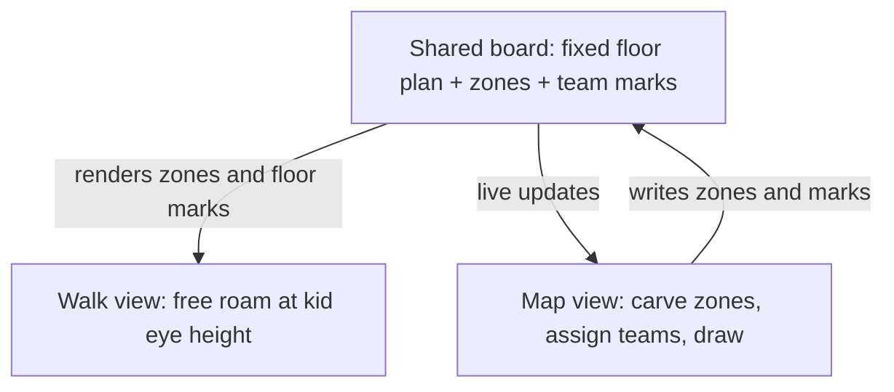

# Haunted House Layout Tool - Plan

## Goal Capsule

- **Objective:** Every team lead for the school haunted house can see their zone of the gym at real scale on their phone, mark it up for their team, and walk the whole house at a third grader's eye height, so that scare pacing and space use are judged from the space itself instead of guessed from a paper sketch.
- **Means:** One web page behind a shared link with two views of the same locked floor plan: a top-down map with team zones and freehand marker drawing, and a first-person free-roam walkthrough.
- **Product authority:** This plan owns the full v1 tool. Follow-ups named under Scope Boundaries (guided walk with timing, scare beats, concept art in 3D, sized props, walking together) are not active scope.
- **Open blockers:** None. Real gym measurements are a dependency on the physical event, not on planning; see Dependencies / Assumptions.

---

## Product Contract

### Summary

A phone-first web page behind one shared link where the gym floor plan is carved into six team zones, each team lead draws on the map with a finger in their team color, and anyone can walk the same space at a third grader's eye height with the marks painted on the floor. Zones, marks, and the walk stay in sync for everyone who opens the link.

### Problem Frame

The school haunted house runs in late October in the gym. Six teams each own a themed section under the theme "Secret World of Arrietty": the visitor is tiny and everyday school objects are giant. The floor plan is a hand-drawn sketch with dimensions, and the team concepts are a hand-drawn board. Nothing has been laid out at real scale, and team-to-zone assignment has not happened yet.

The moment of pain is scare pacing. Nobody can tell from the sketch how long a third grader spends in each section, what they can see coming, or where a reveal should land. Team leads plan in isolation from a photo of the sketch, and that guesswork surfaces only on build day, when it is too late to move anything cheaply.

### Key Decisions

- **Map and walkthrough ship together as one product.** (session-settled: user-approved — chosen over map-first or walkthrough-first releases: neither half alone is worth opening on a phone, and both share one layout.) Governs R10, R14.
- **The floor plan is fixed content.** Walls, tents, corridors, and the visitor path are locked for the event; the tool renders them and never lets users move them. Governs R1, R2.
- **Zones are assigned inside the tool.** Team-to-zone assignment is still open, so a coordinator carves and reassigns zones rather than the plan hardcoding a mapping. Governs R3, R4.
- **Freehand marker over sized footprints.** (session-settled: user-directed — chosen over named blocks sized in feet: expressiveness and speed on a phone matter more than marks that stand up in 3D.) Governs R5, R6, R7.
- **One shared live board with no accounts.** (session-settled: user-approved — chosen over per-team links or local-only boards: one source of truth for six teams outweighs the risk of someone erasing another team's marks.) Governs R8, R9, R16.
- **Walkthrough shows walls, zones, and floor marks only.** (session-settled: user-directed — chosen over concept art on the walls or scare beats on the path: the space itself is the point of v1.) Governs R10.
- **Free roam over a guided walk.** (session-settled: user-directed — chosen over an auto-walk along the visitor path with a clock: feeling the space and sightlines comes first; pacing stays a human judgment.) Governs R11, R12, R13.
- **A running clock and current zone name ride along in free roam.** The cheapest pacing aid that survives the free-roam choice. Governs R12.
- **Product shape is the two-view planner.** Chosen over walk-first marking inside the 3D world and over adding multi-phone presence in v1: team leads plan alone on phones, and a flat map is the fastest surface to mark up. Governs R14.

### Actors

- A1. **Team lead** — a parent or teacher who owns one zone. Opens the link on a phone, finds their zone, draws where props and scares go, and walks their zone to judge it. The primary user.
- A2. **Coordinator** — the organizer of the whole house. Carves the floor plan into zones, assigns teams, watches boundaries and transitions across all six zones.
- A3. **Meeting viewer** — anyone at a volunteer meeting looking at an iPad or a mirrored screen while someone else walks the house. Reads, does not edit.

### Requirements

**Floor plan and zones**

- R1. The map shows the gym floor plan from the sketch as a top-down drawing at one consistent real-world scale in feet: outer walls, stage and pony wall, both tent blocks, the diagonal wall, interior partitions, the right corridor wall, entrance, exit, and the dashed visitor path.
- R2. Users cannot move, add, or delete walls, tents, or the visitor path.
- R3. A coordinator can carve the floor plan into zones bounded by existing walls and the visitor path, assign each zone one of the six teams (Poison Breakfast, Hallway/Library, Lost & Found Playground, Schoolyard Dangers, Garden, Exit) with that team's color, and change any assignment at any time.
- R4. Every zone shows its team name and color, on the map and in the walk.

**Drawing**

- R5. Any user can draw freehand strokes and place short text labels anywhere on the map with one finger, in a chosen team color.
- R6. Marks belong to the team color they were drawn in; a user can show or hide each team's marks, undo their own recent marks, and erase any mark.
- R7. One finger draws; two fingers pan and zoom the map without drawing, on iPhone and iPad.

**Sharing**

- R8. Everyone who opens the link sees the same zones and marks, and a change made on one device appears on other open devices within a few seconds.
- R9. Zones and marks persist across visits and browser restarts without any sign-in.

**Walkthrough**

- R10. The walk view places the user inside the same floor plan at a third grader's eye height, with walls at realistic height, each zone's floor tinted in its team color, and marks painted on the floor exactly where they were drawn on the map.
- R11. The user moves and looks around with on-screen touch controls, and walls block movement.
- R12. The walk shows a running clock since the walk began and the name of the zone the user is standing in.
- R13. A walk starts at the entrance by default, and a user can also start it from a spot they tap on the map.
- R14. Map view and walk view switch in one tap and show the same zones and marks at all times.

**Devices and access**

- R15. The tool runs in the browser on iPhone and iPad in portrait and landscape, and on a desktop browser, with nothing to install.
- R16. Anyone with the link can do everything the tool offers; there are no accounts, roles, or passwords.

### Key Flows

- F1. Coordinator sets up zones
  - **Trigger:** The coordinator opens the link for the first time.
  - **Actors:** A2
  - **Steps:** The floor plan is shown with no zones. The coordinator outlines a zone along existing walls, picks a team for it, and repeats until the whole visitor path is covered. Later, the coordinator reassigns a zone to a different team.
  - **Outcome:** Six colored, named zones, visible to everyone on the next refresh.
  - **Covered by:** R1, R3, R4, R8

- F2. Team lead marks up their zone
  - **Trigger:** A team lead opens the link on their phone during the week.
  - **Actors:** A1
  - **Steps:** They find their zone by color and name, pinch to zoom in, pick their team color, draw where the giant props and scares go, and add a text label or two. A stray stroke is undone.
  - **Outcome:** Their marks appear on every other open device within seconds and are still there the next day.
  - **Covered by:** R5, R6, R7, R8, R9

- F3. Walk the house at kid height
  - **Trigger:** Any user taps the walk view.
  - **Actors:** A1, A2, A3
  - **Steps:** The user starts at the entrance at a third grader's eye height, walks the tents, the diagonal corridor, the serpentine, and the right corridor using touch controls, sees each zone's color underfoot and the team's marks on the floor, and watches the clock and zone name change as they go. Walls stop them.
  - **Outcome:** A felt sense of sightlines, corridor lengths, and time per zone.
  - **Covered by:** R10, R11, R12, R13, R14

- F4. Meeting walkthrough
  - **Trigger:** A volunteer meeting with an iPad passed around or mirrored to a screen.
  - **Actors:** A2, A3
  - **Steps:** The coordinator taps a spot on the map to start the walk inside a zone under discussion, walks it while people watch, and switches back to the map to point at marks.
  - **Outcome:** The group is imagining the same space.
  - **Covered by:** R13, R14, R15

### Acceptance Examples

- AE1. **Covers R3, R4.** Given the Garden zone is assigned to the right corridor, when the coordinator reassigns that zone to Schoolyard Dangers, then the corridor changes to the red team color and label on every open map and in the walk.
- AE2. **Covers R5, R8.** Given two phones have the link open, when one draws a green stroke inside the entrance tents, then the other phone shows the same stroke in the same place within a few seconds without reloading.
- AE3. **Covers R6.** Given marks from three teams overlap in the serpentine, when a user hides the purple team's marks, then only the purple marks disappear on that user's device and nothing is deleted for anyone else.
- AE4. **Covers R6, R16.** Given a mark drawn by another team, when a user erases it, then it is gone for everyone, with no prompt for permission.
- AE5. **Covers R7.** Given the map is zoomed out, when a user places two fingers and pinches, then the map zooms and no stroke is drawn.
- AE6. **Covers R10, R14.** Given a text label "milk carton lurker" drawn in the entrance tents, when a user walks into that tent, then the same label is visible on the floor at that spot.
- AE7. **Covers R11.** Given the user walks toward the diagonal wall, when they reach it, then they stop at the wall and cannot pass through it.
- AE8. **Covers R12, R13.** Given the user starts a walk from the entrance, when they enter the second zone, then the zone name changes and the clock keeps counting from the walk's start.
- AE9. **Covers R9.** Given marks and zones exist, when every device closes the page and one reopens it the next day, then all zones and marks are still there.

### Success Criteria

- All six team leads have drawn in their zone before build day.
- The group has walked the house at kid height together in at least one volunteer meeting.
- A first-time user on an iPhone can find their zone and draw a stroke within a minute with no instructions.
- The walk feels smooth on a few-year-old iPhone, not a slideshow.

### Scope Boundaries

**Deferred for later**

- Guided walk along the visitor path at a kid's pace with a timeline of time per zone.
- Named scare moments on the path that show as beats while walking.
- Team concept board art shown on the walls of each zone in the walk.
- Placeable objects with real sizes and a library of ideas per zone; the objects-and-ideas follow-up the organizer named.
- Multiple phones in the same walk at once, seeing each other as kid-height figures.
- Export, print, or snapshot of the map.

**Outside this product's identity**

- A general floor planner or CAD tool; the floor plan is fixed content for this one event.
- A game for kids; the walk exists to judge the space, not to entertain.
- Accounts, roles, or permissions of any kind.

### Dependencies / Assumptions

- The sketch's dimensions do not reconcile: a 32 foot diagonal cannot span most of an 85 foot room. The tool starts from the sketch's proportions, and someone measures the gym before anyone builds to the tool's numbers.
- Third grader eye height is taken as 4 feet.
- A trusted group of parent and teacher volunteers uses the link; nobody expects protection from another team's edits.
- Phones have Wi-Fi or cellular data when in use, including during meetings in the gym.
- Six teams and six concepts, as on the concept board; the theme is Secret World of Arrietty.
- The repository holds no application code yet; everything here is net new.

### Outstanding Questions

**Deferred to Planning**

- Whether to build the map and walk from scratch or adapt a third-party drawing or 3D tool; the organizer is open to either, and simplicity wins ties.
- How the shared board is hosted so that one link works with no sign-in and survives the event, and what a user sees if the connection drops mid-session.
- Whether marks can also be drawn while standing in the walk view; not required for v1.
- Whether zones cover only the visitor path or the whole gym, including backstage and the stage.

### Sources

- `docs/plans/assets/gym-floor-plan-sketch.jpg`: the hand-drawn floor plan with dimensions (85 by 60 feet, 50 foot pony wall, two tent blocks of 10 foot tents, 32 foot diagonal with 8 foot panels, right corridor with 8 foot panels, dashed visitor path).
- `docs/plans/assets/team-concept-board.jpg`: the six team concepts with their marker colors: Poison Breakfast (green), Hallway/Library (blue), Lost & Found Playground (purple), Schoolyard Dangers (red), Garden (yellow), Exit (pink).
