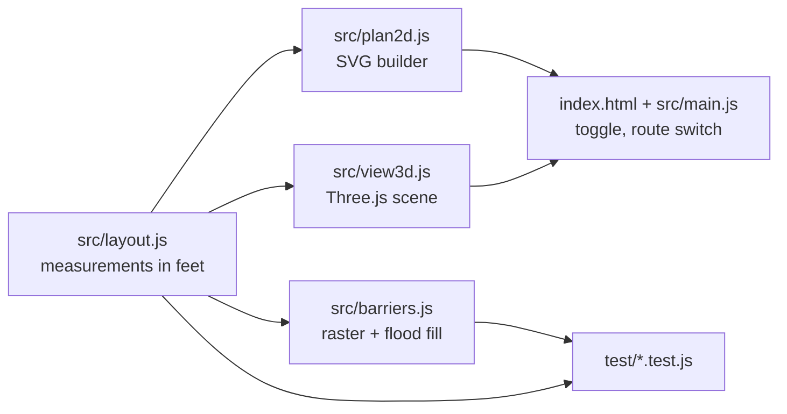

# Gym Layout Viewer - Plan

## Goal Capsule

- Objective: Anyone helping build the school haunted house can open one page on a phone and see the gym layout at true proportions, with the walls that force visitors along the route, in a flat 2D view or a 3D model they can spin.
- Means: A build-free static page whose 2D and 3D views both draw from one measurement list (KTD1, KTD2).
- Authority: Product Contract requirements win on behavior. KTDs win on mechanism. Units implement; they do not amend either.
- Stop conditions: Stop and report if the measured layout cannot be made leak-free without moving a wall the sketch fixes, or if the vendored 3D library cannot load from a static file server.
- Execution profile: Greenfield, Node 22 for tests only, no bundler, no npm runtime dependencies. U1 first, then U2 and U3 in either order, then U4.
- Tail ownership: The caller owns review, browser testing, commit, and PR.

---

## Product Contract

### Summary

Build one static web page that renders the gym haunted house to scale from a single list of measurements. Walls are the strongest visual element. A toggle switches between a top-down 2D plan and an orbitable 3D model. The visitor route shows as a lighter line that can be hidden.

### Problem Frame

The only layout today is a hand sketch whose labels and drawing disagree. Team leads cannot judge real proportions from it, and nobody can see at a glance that the walls actually funnel visitors along one route. A previous attempt grew into a large multi-feature app and lost this core view.

### Requirements

- R1. The page shows the full 85 ft by 60 ft gym at one consistent scale: outer walls, stage with its 50 ft pony wall, six 10 ft by 10 ft tents, entrance doors on the left wall, and the exit door on the right wall near the top.
- R2. The page shows every separation wall from the sketch: the diagonal wall, the right corridor wall, and the three serpentine partitions.
- R3. Walls are the dominant visual element in both views, clearly heavier than tents, labels, and the route line.
- R4. The walls and closed tent sides are leak-free: the only walkable route from the entrance door reaches the exit door through the left tents, the serpentine, and the right tents, and no off-route area is reachable.
- R5. A visitor route line follows the sketch's dashed path and can be shown or hidden. It is on by default.
- R6. A toggle switches between a top-down 2D view and a 3D model with 8 ft walls and canopy tents that the user can rotate and zoom with touch or mouse. While the 3D view loads it says so. If 3D cannot load or the device has no WebGL, the page says 3D is unavailable and stays on 2D.
- R7. All positions and lengths come from one measurement list, so correcting one measured value updates both views.
- R8. Key measurements are labeled on the 2D view: room width and depth, diagonal length, corridor wall length, pony wall length, and tent size. Entrance, Exit, and Stage are named, and the route line shows its direction. Labels stay readable at 390 px width without zooming and do not overlap.
- R9. The page works on a phone screen without horizontal scrolling and needs no account, server state, or network sync.

### Key Decisions

- Diagonal follows the drawing, about 52.5 ft. (session-settled: user-directed, chosen over "the 32 ft label wins and the maze slides left" and "a 32 ft wall that stops short and leaves a gap": the user compared three to-scale sketches and said the drawing matches the real gym.) Governs R2, R7, R8.
- 2D and orbitable 3D, no walkthrough. (session-settled: user-directed, chosen over a kid-height first-person walkthrough: the user wants to see the layout, not walk it.) Governs R6.
- Layout only, no team zones. (session-settled: user-directed, chosen over tinting route sections in team colors: teams come later.) Governs R1.

### Scope Boundaries

- Deferred for later: team zones and colors, notes or drawing on the map, a printable sheet, editing measurements in the page.
- Outside this product: accounts, live sync, first-person walkthrough.

### Acceptance Examples

- AE1. Covers R4. Given the layout, when a flood fill starts at the entrance door, then it reaches the exit door and does not reach the area above the diagonal, the strip right of the corridor wall, or the stage.
- AE2. Covers R7. Given the diagonal end point changes in the measurement list, when the page reloads, then the 2D wall, the 3D wall, and the diagonal length label all show the new value.
- AE3. Covers R5. Given the route line is visible, when the user turns it off, then it disappears in both views and the walls still show the route.

### Sources

- `docs/plans/assets/gym-floor-plan-sketch.jpg`: room size, tent sizes, panel counts, pony wall, doors, and the dashed route.
- `docs/plans/assets/gym-build-wall-frames.jpg` and `docs/plans/assets/gym-build-black-sheeting.jpg`: 8 ft black-sheeted stud walls, pop-up canopy tents, tan floor.

---

## Planning Contract

### Key Technical Decisions

- KTD1. One plain ES module, `src/layout.js`, holds every measurement in feet with the origin at the top-left corner of the room, x to the right and y down. It exports a `MEASUREMENTS` object of raw inputs, a `buildLayout(measurements)` function that derives everything else, and a default `layout` built from `MEASUREMENTS`. A layout holds walls as segments with a height, tents as squares with per-side open or closed state, doors as openings, and the route as a waypoint list. Both views take a layout object as a parameter, so tests can render a modified one. Governs the mechanism for R7.
- KTD7. Attachment points are derived, not typed twice. Partition tops come from the diagonal line. The corridor wall runs from the bottom of R3 to the pony wall line, so its length flexes when the stage depth or the gap above the right tents is measured. P2's base and the left tent bottoms sit on the pony wall line. The diagonal end point is derived as the point on R1's left side at the measured drop, so it stays attached when tents move. A one-value correction therefore cannot open a leak, and the leak test still guards against bad inputs. Governs the mechanism for R4, R7.
- KTD2. No bundler and no runtime npm dependencies. `index.html` loads ES modules directly. Three.js r186 (`three@0.186.1`) is vendored under `vendor/three/` as the unminified `three.module.js` and `three.core.js` (the package ships no minified module build, and the module imports the core file by relative path), plus `OrbitControls.js`. An import map maps the bare specifier `three` to `vendor/three/three.module.js`, so the page works from any static file server and offline. Chosen over a CDN import because a vendored copy cannot drift or break with a CDN outage, and over a bundler because the previous attempt's tooling was the sprawl.
- KTD3. The 2D view is generated SVG with a viewBox in feet. The browser's own pinch zoom handles zoom on phones, so no custom gesture code exists.
- KTD4. The 3D view loads on first switch through a dynamic import, so the 2D view never waits for Three.js. Walls are boxes 0.5 ft thick at their own height: 8 ft for stud walls and about 4 ft for the pony wall. Tents are a roof outline at 7 ft on four legs, with low-opacity side panels only on closed sides, so walls stay dominant and the route stays visible through the tents. The camera starts above the entrance corner looking across the room. OrbitControls owns drag and pinch inside the canvas (`touch-action: none` on it). The camera cannot go below the floor, and its distance stays between room-filling and room-framing. The 3D scene is hidden, not disposed, when the user switches back to 2D, so the camera angle is kept.
- KTD5. Tent sides count as barriers unless marked open. This assumes the real tents have sidewalls, which a dark haunted house needs. Open sides are the shared edges inside a tent block plus the entry and exit openings on the route. This is what makes R4 possible, because the route passes through the tents.
- KTD6. Leak-freedom is tested, not eyeballed. A pure function rasterizes all barriers onto a 0.25 ft grid as supercover lines (every cell a segment passes through) and flood-fills from the entrance door with 4-connectivity, so sloped walls have no corner-only gaps. The test asserts the exit door is reached, sample points in each off-route region are not, and every route waypoint is reachable.

### Starting Geometry

Values come from the sketch at its drawn proportions. The serpentine partitions have no labels, so they are placed by eye. Each is one number to correct after measuring.

| Element | Start (ft) | End (ft) | Notes |
| --- | --- | --- | --- |
| Room | (0, 0) | (85, 60) | Outer walls |
| Pony wall | (20, 56) | (70, 56) | About 4 ft tall. Stage occupies y 56 to 60 |
| Left tents | L1 (0, 46), L2 (10, 46), L3 (10, 36) | 10 ft squares | Bottoms meet the pony wall line |
| Right tents | R1 (65, 4), R2 (75, 4), R3 (65, 14) | 10 ft squares | |
| Diagonal | (20, 36) | (65, 9) | About 52.5 ft, about 7 panels. Ends partway up R1's left side, as drawn |
| Right corridor wall | (65, 24) | (65, 56) | Derived, 32 ft, four panels at starting values |
| Partition P1 | (30, 30) | (30, 46.5) | Hangs from the diagonal |
| Partition P2 | (43, 56) | (43, 37.5) | Rises from the pony wall |
| Partition P3 | (55, 15) | (55, 39.5) | Hangs from the diagonal |
| Entrance door | left wall, y 48 to 54 | | Into L1 |
| Exit door | right wall, y 6 to 10 | | Out of R2 |

Tent openings on the route: L1 to L2 shared edge, L2 to L3 shared edge, L3 right side near y 37 to 41, R3 left side near y 15 to 22, R3 to R1 shared edge, R1 to R2 shared edge, L1 left side at the entrance door (y 48 to 54), R2 right side at the exit door (y 6 to 10). All other tent sides are closed.

Partition tops sit on the diagonal line and the corridor wall bottom sits on the pony wall, so there is no gap like the sketch's corridor leak (KTD7). The corridor wall comes out at 32 ft only because the two unmeasured 4 ft values (stage depth, gap above the right tents) happen to close the 60 ft depth. When either is measured, the corridor wall length changes and its label shows the new panel count.

### High-Level Technical Design



### Assumptions

- Tents have closed sidewalls except the route openings (KTD5). The leak guarantee depends on this. Confirm with the build team before event setup.
- Partition positions are by eye from the sketch until measured.
- The stage is 4 ft deep inside the 60 ft depth, and the gap above the right tents is 4 ft. Neither is labeled on the sketch. KTD7 lets the corridor wall absorb a correction to either.
- The pony wall is about 4 ft tall.

---

## Output Structure

```
index.html
src/
  layout.js
  barriers.js
  plan2d.js
  view3d.js
  main.js
  styles.css
vendor/three/
  three.module.js
  three.core.js
  OrbitControls.js
  LICENSE
test/
  layout.test.js
  barriers.test.js
  plan2d.test.js
package.json
README.md
```

---

## Implementation Units

### U1. Measurement list and barrier model

- Goal: The single source of geometry, plus the leak check that proves the walls force the route.
- Requirements: R1, R2, R4, R7. Implements the diagonal Key Decision and KTD1, KTD5, KTD6.
- Dependencies: none.
- Files: `src/layout.js`, `src/barriers.js`, `test/layout.test.js`, `test/barriers.test.js`, `package.json`.
- Approach:
  1. `layout.js` exports `MEASUREMENTS` with the raw values in Starting Geometry and `buildLayout` per KTD1 and KTD7.
  2. The built layout carries derived values used by both views: wall lengths, panel counts at 8 ft, and the barrier segment list (walls plus closed tent sides minus door openings).
  3. `barriers.js` rasterizes barrier segments onto a grid and flood-fills from a start point. It returns a reachability query.
  4. `package.json` has no dependencies and a `test` script running Node's built-in test runner.
- Test scenarios:
  - Covers AE1. Flood fill from the entrance door reaches the exit door.
  - Covers AE1. Points (5, 20) above the diagonal, (75, 40) right of the corridor wall, (45, 58) on the stage, and (80, 1) above the right tents are unreachable.
  - Every route waypoint is reachable.
  - Each partition top lies on the diagonal within 0.1 ft, and the corridor wall bottom lies on the pony wall.
  - Diagonal length is between 52 and 53 ft, and the corridor wall is 32 ft at the starting values.
  - With the stage depth changed to 3 ft, the corridor wall still meets the pony wall and the leak test still passes.
  - With the diagonal drop on R1 changed, partition tops still lie on the diagonal and the leak test still passes.
  - Removing the corridor wall from the barrier list makes (75, 40) reachable, proving the test can detect a leak.
  - All tents are 10 ft squares inside the room bounds.
- Verification: the tests pass, and a deliberately opened gap fails the leak test.

### U2. 2D plan

- Goal: A to-scale top-down SVG where walls dominate and the route can be hidden.
- Requirements: R1, R2, R3, R5, R8, R9. Implements KTD3.
- Dependencies: U1.
- Files: `src/plan2d.js`, `test/plan2d.test.js`.
- Approach:
  1. Build the SVG markup from `layout.js` with a viewBox in feet plus a margin for labels.
  2. Draw layers in order: floor, off-route areas in a muted fill, stage, tents with thin closed sides, walls as the heaviest strokes, doors, route line in its own group, labels.
  3. Labels read their numbers from the built layout, never literals.
  4. Dimension labels sit in the margin on dimension lines. Wall labels sit offset from their walls. The SVG fills the width and keeps its aspect ratio in portrait.
  5. The SVG carries a title and a short description of the layout for screen readers.
- Test scenarios:
  - The SVG contains one wall element per wall segment in the layout.
  - Covers AE2. With a layout built from modified measurements that change the diagonal, the diagonal label shows the new rounded length.
  - Entrance, Exit, and Stage labels exist, and the route line has a direction marker.
  - At the starting geometry, no two label bounding boxes overlap, and the label font size renders at 10 px or more when the SVG is 390 px wide.
  - The route group exists and carries a stable id that the page toggles.
  - The wall stroke width is greater than tent and route stroke widths.
- Verification: the tests pass, and the rendered SVG shows every wall from the sketch.

### U3. 3D model

- Goal: An orbitable 3D model from the same layout.
- Requirements: R3, R5, R6, R7. Implements the 2D/3D Key Decision and KTD2, KTD4.
- Dependencies: U1.
- Files: `src/view3d.js`, `vendor/three/three.module.js`, `vendor/three/three.core.js`, `vendor/three/OrbitControls.js`, `vendor/three/LICENSE`.
- Approach:
  1. Copy `build/three.module.js`, `build/three.core.js`, `examples/jsm/controls/OrbitControls.js`, and `LICENSE` from the `three@0.186.1` package.
  2. Export a mount function that takes a layout and a container, builds the scene per KTD4, and returns handles to show or hide the route, reset the view, and dispose the scene.
  3. Floor is tan. Walls are dark boxes. The route is a light line just above the floor.
  4. Resize with the container. Cap pixel ratio at 2. Rebuild on WebGL context restore.
- Execution note: Prove this unit with a headless browser smoke check that the canvas renders non-blank pixels, rather than unit tests.
- Test expectation: none in Node, because WebGL rendering needs a browser. The caller's browser test covers it.
- Verification: in a browser, the 3D view shows all walls at the right places and drag and pinch rotate and zoom.

### U4. Page shell and toggles

- Goal: The page people open, with the view toggle and route switch.
- Requirements: R5, R6, R9.
- Dependencies: U2, U3.
- Files: `index.html`, `src/main.js`, `src/styles.css`, `README.md`.
- Approach:
  1. `index.html` holds the import map, a header with a 2D/3D segmented toggle and a route checkbox, and one view area.
  2. `main.js` renders the 2D plan at load, imports `view3d.js` on first switch to 3D, and applies the route setting to both views.
  3. During the first 3D load the view area shows a loading message. On import failure or no WebGL it shows that 3D is unavailable and returns the toggle to 2D.
  4. The toggle is a pair of buttons with `aria-pressed`. The route control is a labeled native checkbox. Both have touch targets of at least 44 px and a visible focus state. A Reset view button appears in 3D.
  5. The layout fits phone width with no horizontal scroll, and the viewport allows pinch zoom outside the 3D canvas.
  6. `README.md` explains how to open the page with any static server and that measurements live in `src/layout.js`.
- Test scenarios:
  - Covers AE3. Turning off the route hides it in 2D. Switching to 3D keeps it hidden. Turning it on shows it again.
  - Switching 2D, 3D, 2D works without errors and does not create a second 3D canvas.
  - When the 3D import fails, the page shows the unavailable message and stays on 2D with the plan visible.
- Verification: in a headless browser at phone and desktop widths, both views render, toggles work, and the console has no errors.

---

## Verification Contract

- `npm test` runs Node's built-in test runner over `test/` and passes.
- Serve the repo root with any static server, for example `python3 -m http.server`. Load the page in headless Chromium (the preinstalled browser, driven by Playwright through `npx`, outside `package.json`), launched with `--use-angle=swiftshader --enable-unsafe-swiftshader` so software WebGL works. Check at 390 px and 1280 px widths, judging the 3D canvas from a screenshot. Confirm both views render, the 3D canvas has non-blank pixels, the toggles work, and the console shows no errors.

## Definition of Done

- All R-IDs are met, and AE1 to AE3 are proven by tests or the browser check.
- `npm test` passes and the browser check passes.
- No runtime npm dependencies, no build step, and no leftover experimental files.
