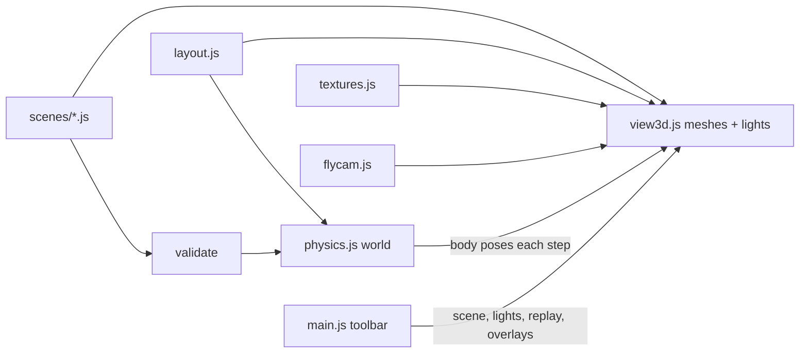

# Realistic 3D Sandbox - Plan

## Goal Capsule

- Objective: A team lead can open the 3D view, fly anywhere through a realistic-looking gym haunted house, watch props obey real physics against the real walls, and switch between prepared idea scenes, so colleagues can judge whether an idea (starting with group 4's Schoolyard Dangers) feels right before anything is built.
- Means: Replace the orbit viewer with a physically lit, textured scene driven by a physics world built from the same layout, a fly-through camera, and scene files that add props and lights (KTD1 to KTD5).
- Authority: Product Contract requirements win on behavior. KTDs win on mechanism. Units implement; they do not amend either.
- Stop conditions: Stop and report if the physics library cannot load from a static file server without a build step, or if the realistic scene renders below 5 fps in headless SwiftShader at low quality.
- Execution profile: Node 22 for tests, no bundler, browser libraries vendored under `vendor/`. U1 to U4 in any order, then U5, then U6.
- Tail ownership: The caller owns review, browser testing, commit, and PR.

---

## Product Contract

### Summary

The 3D view becomes a sandbox. It looks like the real build (gym floor, black plastic sheeting on wood frames, white tents), it is lit like a dark haunted house with real shadows, and props fall, bounce, and roll against the real walls at real-world scale. Navigation is a free fly-through camera. Prop and light ideas live in named scene files that a dropdown switches between. The first scene drops a 6.5 ft inflatable ball into the group 4 lane, alongside a couple of other props.

### Problem Frame

The current 3D view is a clean diagram: flat colors, no lighting mood, nothing moves. It answers "where are the walls" but not "what will it feel like". The team wants to try imaginative ideas, like a giant ball rolling at visitors or a colored spotlight in a dark lane, and show colleagues a convincing demo. This is not CAD; the goal is believable feel, quickly reconfigured.

### Requirements

- R1. The 3D view is replaced, not duplicated: the 3D button opens the realistic sandbox. The 2D plan is unchanged.
- R2. Surfaces look like the real build: a wood gym floor, walls of black plastic sheeting with visible wood frame edges, white tent canopies, and a stage.
- R3. Lighting has a dark show mood with real-time shadows from props and walls. A Lights control switches between Show (dark) and Work lights (bright gym) so the layout can always be seen.
- R4. Props obey physics at real-world scale: gravity at 32.2 ft/s², bouncing, rolling, friction, and air drag. They collide with the floor, every wall, the stage, the pony wall, and the closed tent sides, and with each other.
- R5. Navigation is a free fly-through camera: look by dragging, move forward/back/sideways/up/down from the keyboard, with touch gestures on phones. The camera can pass over and through walls and stays within a box around the gym.
- R6. Ideas are named scene files that place props (shape, size, weight, bounciness, look, start position and timing) and lights (type, color, brightness, position, aim). A Scene dropdown lists them; choosing one rebuilds the props and lights.
- R7. A Replay control restarts the current scene so a drop or roll can be shown again during a demo.
- R8. The shipped default scene drops a 6.5 ft diameter inflatable ball into the group 4 lane, plus a couple of other props and at least one colored light. An Empty scene is also shipped.
- R9. The Route, Measurements, and Groups toggles keep working in the 3D view and stay readable in the dark.
- R10. The page stays usable on phones: a lower quality level is chosen automatically on touch or small screens.

### Key Decisions

- Replace the existing 3D view. (session-settled: user-directed — chosen over a separate Realistic mode beside the clean viewer: the user wants one 3D view.) Governs R1, R9.
- Free fly-through camera. (session-settled: user-directed — chosen over a kid-eye walkthrough mode and orbit: the user wants to fly anywhere, no walking.) Governs R5.
- Whole house, no lane focus. (session-settled: user-directed — chosen over group 4 lane only and whole house with lane focus: any group can use the sandbox.) Governs R2, R4.
- Scene ideas are config files Claude writes, switched by a dropdown. (session-settled: user-approved — chosen over an in-page editor and files plus sliders: far less to build.) Governs R6, R7.

### Scope Boundaries

- No in-page editor, sliders, or drag-to-place props.
- No walkthrough mode, visitor body, or camera collision.
- No sound.
- No group 4 scene design beyond the default demo props; real idea scenes come later as new scene files.
- 2D plan, layout measurements, and leak check are unchanged.

### Acceptance Examples

- AE1. Opening 3D with the default scene: within about two seconds the 6.5 ft ball falls from above the walls into the group 4 lane, bounces a few times with decreasing height, and comes to rest on the floor without passing through any wall.
- AE2. Pressing Replay puts every prop back at its start and the drop happens again.
- AE3. Choosing Empty removes all props and scene lights; choosing the default scene brings them back.
- AE4. Switching Lights to Work lights makes the whole gym clearly visible; Show makes it dark with the scene's colored light pooling on the floor and casting shadows.
- AE5. Holding W flies the camera forward in the look direction; dragging turns the view; on a phone, one-finger drag turns and two-finger pinch flies forward or back.

### Sources

- Layout and current 3D view: `src/layout.js`, `src/view3d.js`, `src/main.js`, `index.html`.
- Build photos for look: `docs/plans/assets/gym-build-wall-frames.jpg`, `docs/plans/assets/gym-build-black-sheeting.jpg`.
- Concept board for group 4: `docs/plans/assets/team-concept-board.jpg`.

---

## Planning Contract

### Key Technical Decisions

- KTD1. Physics uses cannon-es 0.20.0, vendored as a single ES module at `vendor/cannon-es/cannon-es.js` and imported by relative path (no importmap entry, so the same import works in the browser and under Node tests). It is pure JavaScript. Rapier (compat build) and Ammo were rejected as heavier and more complex than spheres, boxes, and cylinders require. cannon-es has had no release for some years; that maintenance risk is accepted because the API used is small and stable.
- KTD2. The physics world is built by a three.js-free module from the layout plus a scene, in plan feet (x, height, y) and seconds. Walls, stage, pony wall, and closed tent sides become static boxes. Their thickness (0.5 ft), stage height, and tent side height move from `src/view3d.js` into `src/layout.js` so physics and visuals share one source; tent sides get the wall thickness even though they are drawn as planes. Tent canopies are not colliders. The floor is an infinite plane so anything rolling out a door still lands. The view steps at a fixed 1/120 s with at most 8 substeps per frame and a clamped frame delta, and copies body poses onto meshes parented under the room root. Drop delays count in simulation time, and the loop keeps stepping while any prop has a pending delay or any body is awake; otherwise it idles.
- KTD3. A scene is a plain data object in its own file under `src/scenes/`, listed in a registry. Props: id, label, shape (sphere, box, cylinder), size, mass in pounds, bounce, friction, drag (a quadratic air-drag coefficient applied as a force each step, so a light ball falls floatily yet still rolls), rolling resistance (angular damping), look (color plus an optional pattern), start position in plan feet (x, height, y), optional start velocity, optional drop delay. Lights: spot or point, color, intensity, position, aim, shadows on or off. A pure validator rejects bad scenes with a clear message so a typo in a new file fails a test, not the demo.
- KTD4. Realism comes from physically based materials with procedural canvas textures (wood planks with court lines, wrinkled black sheeting, pine frame, canopy fabric), ACES tone mapping, a soft environment reflection from three's RoomEnvironment addon (vendored from r186) through PMREM, and PCF shadow maps softened with shadow radius (PCFSoftShadowMap is removed in r186). Procedural textures avoid shipping image files and tile at any size. Two lighting presets (Show, Work lights) set the base lights and the environment intensity (low in Show so the dark mood holds); scene lights add on top.
- KTD5. The fly camera is a small local module with no three.js import: a pure step function (look angles, position, input, elapsed time to new pose) plus DOM bindings that touch `window` only when attached. Keyboard: W/S or Up/Down fly forward/back, A/D strafe, Left/Right turn, E up, Q down, Shift faster; mouse drag looks; wheel flies forward/back. Touch: one finger looks; with two fingers the dominant component wins per gesture: pinch flies forward/back, horizontal drag slides, vertical drag moves up/down. The canvas is focusable and takes focus back after any toolbar change so fly keys never go dead. It replaces OrbitControls, which is removed from `vendor/three/`.
- KTD6. Quality is automatic: touch or narrow screens get low (pixel ratio 1, fewer shadow-casting lights, smaller shadow maps); others get high. `?quality=low|high` overrides for testing.
- KTD7. The view exposes a read-only debug snapshot (prop positions, simulation time, sleeping and pending state, current scene, camera pose), published by `src/main.js` as `window.__sandbox` once 3D mounts, so browser tests can assert behavior, not just pixels.
- KTD8. The 3D view opens in Work lights so a first look is never a black screen. The Lights choice persists across scene switches and Replay. The existing loading status shows until the first frame renders.

### High-Level Technical Design

Directional only.



Each frame: read fly input and step the camera; if any prop has a pending drop or any body is awake, advance physics in fixed steps and copy poses; render when the camera moved, a body moved, or a setting changed; otherwise idle.

### Assumptions

- The work stacks on the open groups branch (PR #7), because R9 needs the Groups overlay.
- The 6.5 ft inflatable ball weighs about 6 lb, bounces with restitution around 0.6 on wood, and has noticeable air drag. Values are tunable in its scene file.
- Wall height stays at the layout's 8 ft; the gym ceiling is not modeled.
- Headless Chromium with SwiftShader is the test browser; it is slow but renders shadows.

---

## Output Structure

```text
vendor/cannon-es/cannon-es.js, LICENSE   (new)
vendor/three/OrbitControls.js            (removed)
vendor/three/RoomEnvironment.js          (new)
src/physics.js                           (new)
src/flycam.js                            (new)
src/textures.js                          (new)
src/scenes/index.js, validate.js         (new)
src/scenes/schoolyard-demo.js, empty.js  (new)
src/layout.js, src/view3d.js, src/main.js, index.html, src/styles.css   (changed)
test/physics.test.js, scenes.test.js, flycam.test.js     (new)
```

---

## Implementation Units

### U1. Physics world from the layout

- Goal: A three.js-free physics world built from the layout and a scene.
- Requirements: R4, KTD1, KTD2.
- Dependencies: none.
- Files: `vendor/cannon-es/cannon-es.js`, `vendor/cannon-es/LICENSE`, `src/layout.js` (shared heights and thickness), `src/physics.js`, `test/physics.test.js`.
- Approach: Download the cannon-es 0.20.0 ESM build into `vendor/`. Build static boxes from `layout.walls`, the stage, and `layout.tentSides`; add dynamic bodies from scene props with mass, contact material (bounce, friction), a quadratic drag force, and angular damping for rolling resistance. Expose step, reset (restores poses, zero velocity, restarts the delay clock, wakes bodies), an is-active check (pending delay or awake body), and per-prop pose read-out. A delayed prop is held in place until its simulation-time delay ends.
- Test scenarios:
  - A 6.5 ft ball dropped from 20 ft into the group 4 lane comes to rest with its center at about 3.25 ft and never crosses a wall segment (leaving through a doorway is allowed).
  - Its first bounce peak is lower than the drop height and later peaks shrink.
  - A ball thrown hard and level at a partition, and another at a closed tent side, each end on their own side.
  - With every other body already asleep, a delayed prop still falls when its delay ends.
  - The default ball given a 10 ft/s roll along the floor travels at least 8 ft before stopping.
  - A prop with a drop delay does not move before its delay and falls after.
  - Reset returns every prop to its start pose and zero velocity.
  - After 20 s of simulated time, every body is asleep.
- Verification: `npm test` passes the physics tests.

### U2. Scene files and validation

- Goal: Named scenes as data, a registry, and a validator.
- Requirements: R6, R8, KTD3.
- Dependencies: none.
- Files: `src/scenes/index.js`, `src/scenes/validate.js`, `src/scenes/schoolyard-demo.js`, `src/scenes/empty.js`, `test/scenes.test.js`.
- Approach: The default scene, "Schoolyard demo", holds the 6.5 ft inflatable ball dropping into the group 4 lane (Third lane, between partitions P2 at x 43 ft and P3 at x 55 ft) after a short delay, a stack of giant cardboard boxes in the lane for it to hit, a giant soccer ball near the lane entrance, a red spotlight on that lane, and a cool fill light. The registry header explains how to add a scene. The validator checks shapes, positive sizes and masses, number ranges, starts inside the room footprint at heights from 0 to 40 ft, and unique ids.
- Test scenarios:
  - Every registered scene passes validation, and ids are unique.
  - The default scene contains a sphere with 6.5 ft diameter.
  - A scene with an unknown shape, a negative size, or a start outside the room fails with a message naming the prop.
- Verification: `npm test` passes the scene tests.

### U3. Fly-through camera

- Goal: Free camera controls replacing OrbitControls.
- Requirements: R5, KTD5.
- Dependencies: none.
- Files: `src/flycam.js`, `test/flycam.test.js`, `vendor/three/OrbitControls.js` (removed).
- Approach: Pure step function plus a binder that attaches keyboard, pointer, wheel, and touch listeners to the canvas and reports whether the camera moved. Pitch is clamped short of straight up and down; position is clamped to a box around the gym and above the floor. Keys are ignored while focus is in a form control.
- Test scenarios:
  - Forward input for one second at base speed moves the camera that distance along the look direction.
  - Up input raises height without changing x and z.
  - Pitch never passes the clamp; position never leaves the box or goes under the floor.
  - Zero input yields no movement and reports not moved.
- Verification: `npm test` passes the fly camera tests.

### U4. Realistic look and lighting

- Goal: Physically based materials, procedural textures, Show and Work lights presets, shadows, quality levels.
- Requirements: R2, R3, R10, KTD4, KTD6.
- Dependencies: none.
- Files: `src/textures.js`, `src/view3d.js`, `vendor/three/RoomEnvironment.js`.
- Approach: Canvas-generated color and roughness/bump maps tiled in feet. Walls are sheeting-covered boxes with a pine rail on top and at ends. Tents get fabric canopies and side panels. Overlays (route, measurements, groups) stay unlit with tone mapping off, so they read in the dark and keep the 2D plan's colors; labels remain camera-facing sprites.
- Test expectation: none -- visual output, covered by U6 browser screenshots.
- Verification: Screenshots in both presets show textures, shadows, and readable overlays.

### U5. Sandbox view integration

- Goal: The realistic view runs physics, the fly camera, scene switching, and replay.
- Requirements: R1, R4, R6, R7, R9, KTD2, KTD7.
- Dependencies: U1, U2, U3, U4.
- Files: `src/view3d.js`.
- Approach: The mount API keeps its overlay setters and show/hide/dispose, and adds set scene, set lights, replay, and debug snapshot. Reset view returns the camera to the start pose framing the whole gym. Scene changes dispose old prop meshes, bodies, and lights. The loop idles when nothing moves.
- Test scenarios: Covered by U6 browser checks (drop and settle, replay, scene switch, overlays).
- Verification: U6 smoke passes.

### U6. Page controls and browser verification

- Goal: Toolbar wiring and an end-to-end browser check with screenshots.
- Requirements: R1, R3, R5, R6, R7, R9, AE1 to AE5.
- Dependencies: U5.
- Files: `index.html`, `src/main.js`, `src/styles.css`.
- Approach: Scene dropdown, Lights select, and Replay appear only in 3D, next to Reset view; the toolbar wraps on narrow screens with touch targets of at least 44 px. A small dismissible hint shows keyboard or touch controls per device, in a corner clear of the view center. After any toolbar change focus returns to the canvas. Browser smoke (headless Chromium) reads state only through `window.__sandbox`, waits on simulation time and sleep state rather than wall-clock seconds, and saves screenshots.
- Test scenarios:
  - Default scene: the ball starts high, then rests near 3.25 ft on the floor once the snapshot reports nothing active.
  - Replay puts the ball back up high.
  - Empty scene has no props; switching back restores them.
  - Holding W moves the camera; dragging changes the look direction; after changing the Scene select, W still moves the camera.
  - Route, Measurements, Groups toggles change visibility in 3D.
  - No console errors; 2D still renders.
- Verification: Screenshots of Show, Work lights, mid-drop, settled, and a low-flying view.

---

## Verification Contract

- `npm test` (Node built-in runner): all existing tests plus the physics, scenes, and fly camera tests.
- Browser smoke: serve the repo root with `python3 -m http.server`, drive headless Chromium, assert the U6 scenarios, and capture screenshots.

## Definition of Done

- Every R1 to R10 is met and AE1 to AE5 are observed in the browser.
- `npm test` is green and the browser smoke passes with screenshots saved.
- OrbitControls is removed and nothing imports it.
- No experimental or abandoned code remains in the diff.
